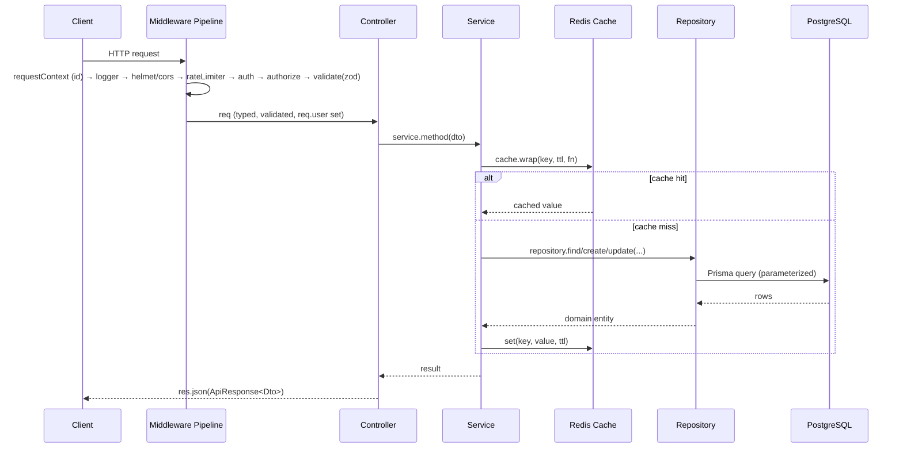
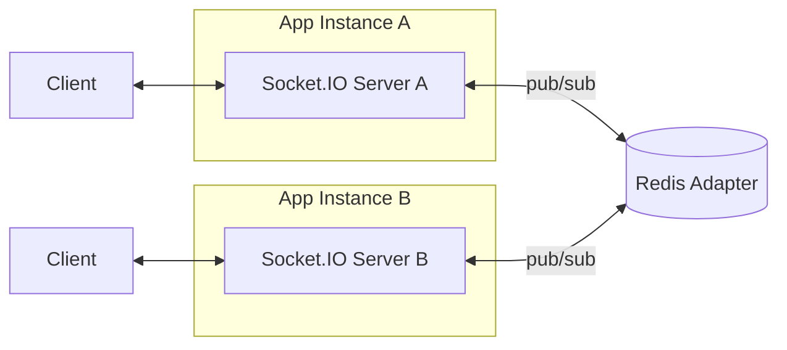
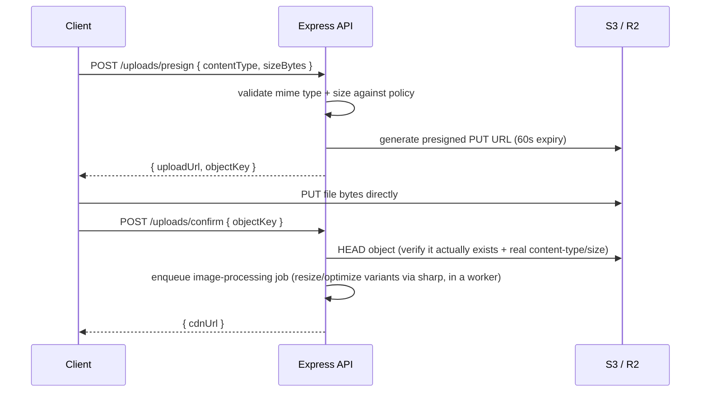
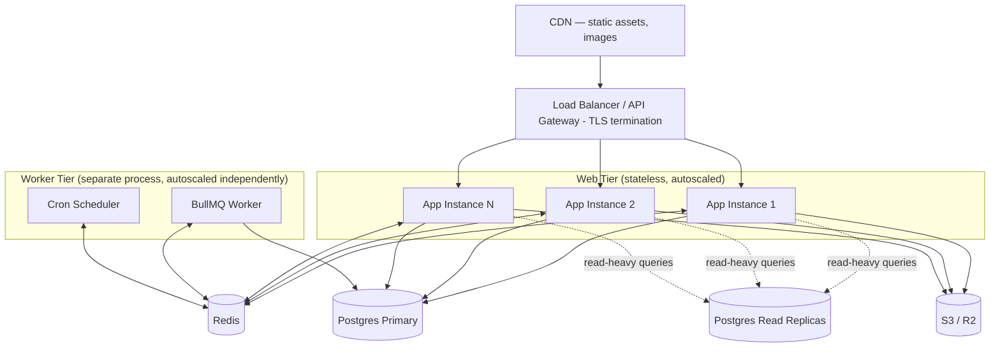

# MarketVerse — Production Express.js Backend Architecture

**Companion to:** [PRD.md](./PRD.md) · [FEATURE_LIST.md](./FEATURE_LIST.md) · [DATABASE_DESIGN.md](./DATABASE_DESIGN.md) · [../server](../server)
**Status:** Draft v1.0
**Stack:** Node.js 22 LTS · TypeScript · Express 5 · Prisma 7 · PostgreSQL · Redis · BullMQ · Socket.IO

---

## 1. Architectural Style

**Modular monolith**, not microservices, not a flat MVC pile — one deployable Node service internally partitioned into **domain modules** (`stores`, `inventory`, `missions`, `social`, …), each following the same internal layering (Controller → Service → Repository), plus a shared cross-cutting `common/`/`lib/` layer.

Why this, specifically, for MarketVerse:
- **Microservices too early** — at MVP scale (PRD §19), splitting `stores`, `inventory`, and `economy` into separate deployable services buys network-call overhead and distributed-transaction pain (a "sell item" action touches inventory *and* wallet atomically) for no real benefit yet. A modular monolith keeps that transaction a single Postgres transaction.
- **Flat MVC doesn't survive 45 database models and 20 feature domains** — without module boundaries, `controllers/` becomes a 60-file dumping ground and everything imports everything.
- **The module boundary is the future microservice boundary.** Each `modules/<domain>/` folder only talks to other modules through its `service` (never reaches into another module's `repository` directly), so if `economy` or `notifications` ever needs to be extracted into its own service, the seam already exists.

**Layer responsibilities (strict one-way dependency: Controller → Service → Repository → Prisma):**

| Layer | Owns | Must never |
|---|---|---|
| **Controller** | HTTP concerns only: parse request, call one service method, shape the HTTP response | Contain business logic, touch Prisma directly, touch another module's repository |
| **Service** | Business logic, orchestration, transaction boundaries, cache/queue interaction | Know about `req`/`res`, format HTTP responses, import Express types |
| **Repository** | Data access — the *only* layer that imports `PrismaClient` | Contain business rules, call other repositories' write methods across a transaction boundary it doesn't own |
| **DTO/Validation** | Shape and validate data crossing the HTTP boundary in both directions | Be reused as the internal domain type — DTOs are for the wire, not for passing between services |

---

## 2. Folder Structure

```
server/
├── prisma/
│   ├── schema.prisma
│   └── migrations/
├── src/
│   ├── config/
│   │   ├── env.ts                  # validated, typed environment (zod)
│   │   ├── constants.ts
│   │   └── swagger.ts              # OpenAPI doc generation (optional, MVP+1)
│   ├── lib/                        # thin wrappers around third-party clients — one per external system
│   │   ├── prisma.ts               # singleton PrismaClient (+ read-replica client, see §21)
│   │   ├── redis.ts                # ioredis singleton(s)
│   │   ├── logger.ts               # pino instance
│   │   └── s3.ts                   # S3/R2 client
│   ├── common/
│   │   ├── errors/
│   │   │   ├── AppError.ts
│   │   │   └── errorCatalog.ts
│   │   ├── dto/
│   │   │   ├── pagination.dto.ts
│   │   │   └── apiResponse.dto.ts
│   │   ├── repository/
│   │   │   └── base.repository.ts  # generic Prisma CRUD abstraction
│   │   ├── utils/
│   │   └── types/
│   │       └── express.d.ts        # req.user, req.requestId augmentation
│   ├── middlewares/
│   │   ├── requestContext.middleware.ts   # request id, correlation id, AsyncLocalStorage
│   │   ├── requestLogger.middleware.ts
│   │   ├── auth.middleware.ts             # authenticate (JWT)
│   │   ├── authorize.middleware.ts        # RBAC / ownership checks
│   │   ├── validate.middleware.ts         # zod schema → req.body/query/params
│   │   ├── rateLimiter.middleware.ts
│   │   ├── upload.middleware.ts           # multer config
│   │   ├── notFound.middleware.ts
│   │   └── errorHandler.middleware.ts     # MUST be last
│   ├── modules/
│   │   ├── auth/
│   │   │   ├── auth.routes.ts
│   │   │   ├── auth.controller.ts
│   │   │   ├── auth.service.ts
│   │   │   ├── auth.repository.ts
│   │   │   ├── auth.dto.ts
│   │   │   └── auth.validation.ts
│   │   ├── users/
│   │   ├── stores/
│   │   ├── inventory/
│   │   ├── products/
│   │   ├── warehouse/
│   │   ├── employees/
│   │   ├── economy/               # wallet + ledger
│   │   ├── missions/
│   │   ├── achievements/
│   │   ├── dailyRewards/
│   │   ├── leaderboards/
│   │   ├── social/                # friends, guilds, gifts
│   │   ├── notifications/
│   │   ├── events/
│   │   ├── monetization/          # IAP, subscriptions, season pass
│   │   ├── uploads/                # avatar/store-branding image upload
│   │   └── admin/                  # internal-only routes, gated by AdminRole
│   ├── sockets/
│   │   ├── index.ts                # io server bootstrap + redis adapter
│   │   ├── socketAuth.middleware.ts
│   │   └── namespaces/
│   │       ├── store.namespace.ts
│   │       ├── guild.namespace.ts
│   │       └── notification.namespace.ts
│   ├── jobs/
│   │   ├── queues/
│   │   │   ├── connection.ts       # shared BullMQ Redis connection
│   │   │   ├── registry.ts         # typed queue map
│   │   │   ├── iapVerification.queue.ts
│   │   │   ├── notification.queue.ts
│   │   │   └── leaderboard.queue.ts
│   │   ├── workers/
│   │   │   ├── iapVerification.worker.ts
│   │   │   ├── notification.worker.ts
│   │   │   └── leaderboard.worker.ts
│   │   ├── crons/
│   │   │   ├── registry.ts         # BullMQ repeatable-job definitions
│   │   │   ├── dailyMissionReset.cron.ts
│   │   │   ├── spoilageSweep.cron.ts
│   │   │   ├── leaderboardRecompute.cron.ts
│   │   │   └── subscriptionRenewalCheck.cron.ts
│   │   └── worker.ts               # separate process entrypoint (see §21)
│   ├── cache/
│   │   ├── cache.service.ts        # get/set/wrap/invalidate
│   │   └── keys.ts                 # cache key builders, one per cached shape
│   ├── app.ts                      # express app assembly — no listen()
│   ├── server.ts                   # http server + socket.io + graceful shutdown
│   └── index.ts                    # composition root (web process entrypoint)
├── tests/
│   ├── unit/
│   ├── integration/
│   └── e2e/
├── docker/
│   └── Dockerfile
├── docker-compose.yml
├── .env.example
├── package.json
├── tsconfig.json
└── prisma.config.ts
```

**Why `Controller → Service → Repository` instead of letting controllers call Prisma directly:** every one of the 45 tables in [DATABASE_DESIGN.md](./DATABASE_DESIGN.md) that has soft delete, a ledger, or a history trigger has *rules* about how it may be written (never `DELETE`, always inside a transaction with the wallet, always via the batch-then-aggregate pattern). Repositories are where those rules live exactly once; controllers and services can't route around them by accident.

---

## 3. Request Lifecycle



Errors thrown at any layer propagate up via `next(err)` (or an `asyncHandler` wrapper) straight to the centralized `errorHandler.middleware.ts` — no layer catches-and-formats errors itself except at that one boundary (§17).

---

## 4. Controllers

Thin by design — a controller method should be readable in one glance as "extract input → call one service method → send response."

```ts
// modules/stores/stores.controller.ts
export class StoresController {
  constructor(private readonly storesService: StoresService) {}

  createStore = asyncHandler(async (req: Request, res: Response) => {
    const dto = req.body as CreateStoreDto; // already validated by validate.middleware
    const store = await this.storesService.createStore(req.user!.id, dto);
    res.status(201).json(ok(toStoreResponseDto(store)));
  });

  getStore = asyncHandler(async (req: Request, res: Response) => {
    const store = await this.storesService.getStoreByPublicId(req.params.storeId);
    res.json(ok(toStoreResponseDto(store)));
  });
}
```

Rules enforced by lint config (custom ESLint rule, see §22 CI):
- No `import { prisma }` inside any `*.controller.ts`.
- No `if (req.user.role === ...)` in controllers — that's `authorize.middleware.ts`'s job.
- Every controller method wrapped in `asyncHandler` (no bare `async (req,res) => {}` route handlers — an unhandled rejection there crashes the process instead of hitting the error middleware).

---

## 5. Services

Owns business logic and transaction boundaries. This is where PRD mechanics actually live — e.g., "sell a product" touches `store_inventory`, `inventory_batches`, and `wallet_transactions`/`wallet_balances` atomically:

```ts
// modules/economy/economy.service.ts
export class EconomyService {
  constructor(
    private readonly walletRepo: WalletRepository,
    private readonly inventoryRepo: InventoryRepository,
    private readonly prisma: PrismaClient,
  ) {}

  async sellProduct(storeId: bigint, productId: bigint, quantity: number) {
    return this.prisma.$transaction(async (tx) => {
      const line = await this.inventoryRepo.decrementShelfStock(tx, storeId, productId, quantity);
      const credit = line.price.mul(quantity);
      const balance = await this.walletRepo.credit(tx, {
        userId: line.storeOwnerId,
        currency: 'CASH',
        amount: credit,
        reason: 'PRODUCT_SALE',
        referenceType: 'store_inventory',
        referenceId: line.id,
      });
      return { line, balance };
    });
  }
}
```

Rules:
- **A service method either owns a `$transaction` or doesn't touch more than one repository's write path.** Cross-repository writes outside a transaction are a code-review blocker — they're exactly how a store could lose inventory without crediting cash.
- Services depend on repository **interfaces**, injected via constructor (see §22 testing) — this is what makes services unit-testable without a database.
- Services are where cache invalidation and queue enqueueing happen (a repository never knows the cache exists; a controller never enqueues a job directly).

---

## 6. Repositories

The **only** layer permitted to import `PrismaClient`. Two tiers:

**`common/repository/base.repository.ts`** — generic CRUD any module can extend, encoding the soft-delete convention from [DATABASE_DESIGN.md §7](./DATABASE_DESIGN.md#7-constraints) once:

```ts
export abstract class BaseRepository<TModel, TDelegate extends { findFirst: Function; findMany: Function }> {
  protected abstract readonly delegate: TDelegate;

  async findById(id: bigint): Promise<TModel | null> {
    return this.delegate.findFirst({ where: { id, deletedAt: null } });
  }

  async softDelete(id: bigint): Promise<void> {
    await this.delegate.update({ where: { id }, data: { deletedAt: new Date() } });
  }
}
```

**Module-specific repositories** extend it and add domain queries:

```ts
// modules/stores/stores.repository.ts
export class StoresRepository extends BaseRepository<Store, Prisma.StoreDelegate> {
  protected readonly delegate = this.prisma.store;
  constructor(private readonly prisma: PrismaClient) { super(); }

  findByPublicId(publicId: string) {
    return this.prisma.store.findFirst({ where: { publicId, deletedAt: null } });
  }

  findByOwner(ownerId: bigint, pagination: CursorPagination) {
    return this.prisma.store.findMany({
      where: { ownerId, deletedAt: null },
      take: pagination.limit,
      ...(pagination.cursor && { cursor: { id: pagination.cursor }, skip: 1 }),
      orderBy: { id: 'asc' },
    });
  }
}
```

Every repository method that lists rows uses **cursor pagination** (per [DATABASE_DESIGN.md §12](./DATABASE_DESIGN.md#12-performance-optimizations-at-scale)) — `OFFSET` is banned by convention on any table expected to grow past a few thousand rows.

---

## 7. DTOs

**Input DTOs** (`CreateStoreDto`, `UpdateStoreDto`) are the *validated, narrowed* shape of a request body — produced by `validate.middleware.ts`, never hand-constructed from raw `req.body`.

**Output DTOs** (`StoreResponseDto`) are explicit mapping functions from Prisma models to wire shapes — this is the enforcement point that prevents leaking `passwordHash`, internal `id` (`bigint`), or soft-delete metadata to the client:

```ts
// modules/stores/stores.dto.ts
export interface StoreResponseDto {
  id: string;          // publicId (uuid), never the internal bigint
  name: string;
  slug: string;
  level: number;
  reputationStars: number;
  status: StoreStatus;
  createdAt: string;   // ISO string, not a Date object
}

export function toStoreResponseDto(store: Store): StoreResponseDto {
  return {
    id: store.publicId,
    name: store.name,
    slug: store.slug,
    level: store.level,
    reputationStars: Number(store.reputationStars),
    status: store.status,
    createdAt: store.createdAt.toISOString(),
  };
}
```

**Rule:** a Prisma model instance must never be passed to `res.json()` directly. Every controller response goes through a `to<Entity>ResponseDto` mapper — this is checked in code review, not just convention, because it's the single most common way internal/financial fields leak.

---

## 8. Validation

**Zod**, colocated per module, and reused for both runtime validation and static typing (`z.infer<>`) so the DTO type and the validator can never drift apart:

```ts
// modules/stores/stores.validation.ts
export const createStoreSchema = z.object({
  body: z.object({
    name: z.string().trim().min(3).max(40),
    slug: z.string().regex(/^[a-z0-9-]+$/).min(3).max(40),
  }),
});
export type CreateStoreDto = z.infer<typeof createStoreSchema>['body'];
```

```ts
// middlewares/validate.middleware.ts
export const validate = (schema: ZodSchema) => (req: Request, res: Response, next: NextFunction) => {
  const result = schema.safeParse({ body: req.body, query: req.query, params: req.params });
  if (!result.success) {
    return next(new ValidationError(result.error.flatten()));
  }
  req.body = result.data.body ?? req.body;
  req.query = result.data.query ?? req.query;
  req.params = result.data.params ?? req.params;
  next();
};
```

Applied at the route level, before the controller ever runs:

```ts
router.post('/', authenticate, validate(createStoreSchema), storesController.createStore);
```

Unknown keys are stripped by default (`z.object` strict mode is enabled globally via a shared base schema helper) — a client can never smuggle extra fields (like `id` or `ownerId`) into a create payload.

---

## 9. Authentication

**Scheme:** short-lived JWT access token (15 min) + long-lived opaque refresh token (30 days), matching `user_sessions` in [DATABASE_DESIGN.md §3.1](./DATABASE_DESIGN.md#31-identity-auth--wallet).

- **Access token**: JWT, signed (RS256 — asymmetric so only the auth service holds the signing key; other internal consumers only need the public key to verify), delivered in an `httpOnly`, `Secure`, `SameSite=Strict` cookie for browser play, *or* returned in the JSON body for non-browser/WebView clients that must send it as `Authorization: Bearer`. Never stored in `localStorage` (XSS-exfiltrable).
- **Refresh token**: a random 256-bit token, only its **hash** stored in `user_sessions.refresh_token_hash` (never the raw token) — mirrors password-hash discipline. Rotated on every use (old session row revoked, new one issued) so a stolen refresh token has a one-time window, and reuse of a revoked token triggers **all sessions for that user being revoked** (classic refresh-token-theft detection).
- **Password hashing:** **argon2id** (not bcrypt) — memory-hard, current OWASP recommendation, tuned to ~250ms per hash on production hardware.
- **OAuth (Google/Apple/Facebook):** provider callback verifies the provider's token server-side, upserts an `auth_identities` row (per [DATABASE_DESIGN.md](./DATABASE_DESIGN.md)), then issues MarketVerse's own access/refresh pair — the client never sees or stores the provider token.
- **Device binding:** every session links to a `user_devices` fingerprint; a new-device login triggers a notification (PRD §17) and, above a risk threshold, a step-up email confirmation.

```ts
// middlewares/auth.middleware.ts
export const authenticate = asyncHandler(async (req, res, next) => {
  const token = extractBearerOrCookie(req);
  if (!token) throw new UnauthorizedError('Missing credentials');
  const payload = verifyAccessToken(token); // throws on expiry/invalid signature
  req.user = { id: BigInt(payload.sub), role: payload.role };
  next();
});
```

Admin authentication (`admin_users`) is a **completely separate token audience and signing key** from player authentication — an admin JWT is structurally incapable of passing player-route `authenticate`, and vice versa, so a bug can't accidentally grant admin access via a player token.

---

## 10. Authorization

Two mechanisms, layered:

**1. Role-based (coarse-grained)** — `authorize(...allowedRoles)` for admin-panel routes:

```ts
router.delete('/products/:id', authenticateAdmin, authorize('ECONOMY_MANAGER', 'SUPERADMIN'), productsController.deactivate);
```

**2. Ownership/policy-based (fine-grained)** — most player routes aren't "can this role do X," they're "does this user own this specific store/employee/mission." This is a per-resource check inside the service, not a generic middleware, because it needs to load the resource anyway:

```ts
// modules/stores/stores.service.ts
async updateStore(userId: bigint, storePublicId: string, dto: UpdateStoreDto) {
  const store = await this.storesRepo.findByPublicId(storePublicId);
  if (!store) throw new NotFoundError('Store not found');
  if (store.ownerId !== userId) throw new ForbiddenError('Not your store');
  return this.storesRepo.update(store.id, dto);
}
```

This mirrors [DATABASE_DESIGN.md §18.4](./DATABASE_DESIGN.md)'s "server-authoritative economy" principle from the DB doc — ownership is always re-verified server-side per request, never trusted from a client-supplied field.

---

## 11. Socket Architecture

**Socket.IO**, used for: real-time notifications (PRD §17), guild chat (PRD §16), live leaderboard nudges, and store-visiting presence — never for gameplay-critical writes (those stay HTTP + database transaction; sockets are for push, not for mutating state).



- **`@socket.io/redis-adapter`** fans events out across every app instance via Redis pub/sub — required the moment there's more than one app instance, since a `guild:123` room's members may be connected to different instances. This also removes any need for load-balancer sticky sessions on the WebSocket upgrade path.
- **Auth at handshake, not per-event:** `io.use(socketAuthMiddleware)` verifies the same JWT access token used for HTTP before the connection is accepted; the socket is rejected outright if the token is invalid/expired (client must refresh over HTTP and reconnect).
- **Namespaces per domain**, not one global namespace: `/stores`, `/guilds`, `/notifications` — keeps event names collision-free and lets each namespace apply its own connection middleware (e.g., `/guilds` additionally checks guild membership before allowing room join).
- **Rooms scoped to entities**, never broadcast-to-all: `socket.join(`store:${storeId}`)`, `socket.join(`guild:${guildId}`)`, `socket.join(`user:${userId}`)` for personal notifications. Server-side room membership is re-derived from the database on connect, never trusted from client-sent room names.
- **Backpressure/fan-out safety:** high-fan-out events (e.g., a seasonal event announcement to all online players) go through the `notification` BullMQ queue (§14) and are drained into socket emits in batches, not emitted synchronously from the triggering request.

---

## 12. Redis

One Redis deployment (managed, e.g. ElastiCache/Memorystore/Upstash — clustered once volume warrants it), logically partitioned by **key prefix and, in production, by logical database index** for blast-radius isolation:

| Use | Key prefix | Notes |
|---|---|---|
| Cache-aside reads (§13) | `cache:*` | Short TTLs, safe to flush entirely with zero data-loss risk |
| Rate limiting (§18) | `rl:*` | `rate-limit-redis` store — must be consistent across all app instances |
| Session/refresh-token blocklist (revocation checks) | `session:*` | Small, hot |
| BullMQ (§14/§15) | `bull:*` | Job queues and repeatable-job schedules — **not safe to flush**, treated as durable-ish |
| Socket.IO adapter pub/sub | `socket.io#*` | Ephemeral, adapter-managed |
| Distributed locks (e.g., leaderboard recompute mutual exclusion) | `lock:*` | Short-lived, `SET NX PX` pattern |

**Why one Redis, multiple prefixes, instead of five Redises:** operational simplicity at MVP scale — one thing to provision, monitor, and back up. The prefixes are the seam if/when BullMQ or the cache genuinely need to be split onto dedicated instances for isolation (e.g., a cache flush should never risk queue data) — that's a config change (`REDIS_CACHE_URL` vs `REDIS_QUEUE_URL`), not a code rewrite, because `lib/redis.ts` already exposes named client factories rather than one global client.

---

## 13. Caching

**Cache-aside**, not write-through — the service layer reads-through on miss and writes-around (invalidate, don't update-in-cache, to avoid cache/DB drift bugs):

```ts
// cache/cache.service.ts
export async function wrap<T>(key: string, ttlSeconds: number, fn: () => Promise<T>): Promise<T> {
  const cached = await redis.get(key);
  if (cached) return JSON.parse(cached) as T;

  // Stampede protection: short-lived lock so N concurrent misses don't all hit Postgres.
  const lock = await redis.set(`lock:${key}`, '1', 'NX', 'EX', 5);
  if (!lock) {
    await sleep(50);
    return wrap(key, ttlSeconds, fn); // retry, likely now a hit
  }
  const value = await fn();
  await redis.set(key, JSON.stringify(value), 'EX', ttlSeconds);
  await redis.del(`lock:${key}`);
  return value;
}
```

**What's cached, and for how long** (deliberately short-lived — this is a performance layer, not a source of truth):

| Data | TTL | Invalidation |
|---|---|---|
| Store inventory snapshot (read-heavy per [DATABASE_DESIGN.md §5](./DATABASE_DESIGN.md#5-normalization)) | 10s | On any write to that store's `store_inventory` (explicit `cache.del`) |
| Leaderboard page | 60s | Not invalidated early — leaderboard is a recomputed/derived table already (§12 DB doc), short TTL is enough |
| Product catalog (near-static) | 10 min | Invalidated on admin catalog edit |
| User session/auth lookup | 5 min | Invalidated on logout/password change |

**Rule:** nothing financial (`wallet_balances`, `wallet_transactions`) is ever cached — those reads always go straight to Postgres. Caching is applied to read-heavy, tolerant-of-staleness data only.

---

## 14. Queues

**BullMQ** (Redis-backed) for anything that (a) shouldn't block the HTTP response, (b) needs retries, or (c) needs to run exactly-once-ish across multiple app instances.

| Queue | Triggered by | Why async |
|---|---|---|
| `iap-verification` | IAP purchase webhook/client receipt submit | Calls an external platform API (Apple/Google/Stripe) — must not block the request, must retry on transient failure |
| `notification-fanout` | Mission complete, gift received, event start | Potentially fans out to thousands of connected sockets (§11) — batched, rate-limited |
| `leaderboard-recompute` | Cron-triggered (§15) | Expensive aggregate query across millions of stores — never run inline |
| `email` | Password reset, receipt, security alert | External SMTP/provider call, must retry |

```ts
// jobs/queues/iapVerification.queue.ts
export const iapVerificationQueue = new Queue('iap-verification', {
  connection,
  defaultJobOptions: {
    attempts: 5,
    backoff: { type: 'exponential', delay: 2000 },
    removeOnComplete: { age: 3600 },
    removeOnFail: { age: 86400 }, // kept longer for investigation
  },
});
```

**Idempotency:** every job payload carries a natural idempotency key (e.g., `platformTransactionId` for IAP), and the worker's first step is a check against the relevant table's unique constraint (`iap_transactions.platform_transaction_id`) — a job retried after a partial failure must be safe to run twice. This is enforced by the DB unique constraint from [DATABASE_DESIGN.md](./DATABASE_DESIGN.md), not just application discipline.

**Workers run in a separate process** from the web server (§21) — a slow/stuck job must never starve the HTTP event loop.

---

## 15. Cron Jobs

**BullMQ repeatable jobs, not `node-cron`.** This is a deliberate, non-obvious choice: `node-cron` schedules run *inside the process* — with N horizontally-scaled app instances (§21), a naive `node-cron` job fires N times simultaneously (e.g., N daily mission resets, N duplicate leaderboard recomputes). BullMQ repeatable jobs are scheduled once in Redis and a single worker instance picks up each firing, so the schedule is correct regardless of how many app/worker processes are running.

| Job | Schedule | Does |
|---|---|---|
| `dailyMissionReset` | `0 0 * * *` (server midnight UTC) | Expires yesterday's `DAILY` `user_missions`, assigns today's set |
| `spoilageSweep` | Every 15 min | Scans `inventory_batches` where `expires_at < now()`, transitions `FRESH`/`EXPIRING` → `EXPIRED` |
| `leaderboardRecompute` | Every 5 min | Recomputes `leaderboard_entries` from `stores`/`wallet_balances` (materialized read, per [DATABASE_DESIGN.md §5](./DATABASE_DESIGN.md#5-normalization)) |
| `subscriptionRenewalCheck` | Hourly | Finds `subscriptions` with `current_period_end` passed, transitions status, triggers renewal charge job |
| `partitionMaintenance` | Daily | Invokes `pg_partman.run_maintenance_proc()` (belt-and-suspenders alongside pg_partman's own background worker — see [DATABASE_DESIGN.md §8](./DATABASE_DESIGN.md#8-partitioning--migration-managed-tables)) |

```ts
// jobs/crons/registry.ts
await leaderboardQueue.add('recompute', {}, {
  repeat: { pattern: '*/5 * * * *' },
  jobId: 'leaderboard-recompute', // fixed jobId prevents duplicate schedules on redeploy
});
```

---

## 16. Logging

**Pino** — structured JSON, chosen over Winston/Morgan for throughput (it's meaningfully faster, which matters at the request volumes in [DATABASE_DESIGN.md §12](./DATABASE_DESIGN.md#12-performance-optimizations-at-scale)) and because JSON-native output is what every log aggregator (Loki, Datadog, CloudWatch Logs Insights) wants anyway.

- **Correlation:** `requestContext.middleware.ts` generates a `requestId` (UUID) per request via `AsyncLocalStorage`, attached to every log line emitted during that request's lifetime — including lines logged deep inside a service or repository, without threading `requestId` through every function signature.
- **Levels:** `trace`/`debug` (local dev only) → `info` (business events: "store created", "IAP verified") → `warn` (recoverable — retried job, cache miss storm) → `error` (unhandled exceptions, reaches `errorHandler.middleware.ts`) → `fatal` (process about to exit, see §21 graceful shutdown).
- **Redaction:** `pino`'s built-in `redact` config strips `req.headers.authorization`, `req.headers.cookie`, `body.password`, `body.refreshToken` from every log line automatically — this is configured once, globally, not left to per-call-site discipline.
- **Distinct from `audit_logs` (the DB table):** operational logs (Pino) answer "is the system healthy, what happened during this request" and are typically retained weeks, not months. `audit_logs` ([DATABASE_DESIGN.md §9](./DATABASE_DESIGN.md#9-audit-tables-vs-history-tables)) answers "who did what to this account," is queryable relationally, and is retained per compliance policy. Sensitive mutations get **both** — a Pino `info` line for operational visibility and an `audit_logs` row for the durable record.

---

## 17. Error Handling

**One error hierarchy, one place errors are formatted into HTTP responses.**

```ts
// common/errors/AppError.ts
export class AppError extends Error {
  constructor(
    public readonly statusCode: number,
    public readonly code: string,       // stable machine-readable code, e.g. "STORE_NOT_FOUND"
    message: string,
    public readonly details?: unknown,
    public readonly isOperational = true, // false = programmer error, alert loudly
  ) {
    super(message);
  }
}

export class NotFoundError extends AppError {
  constructor(message = 'Resource not found') { super(404, 'NOT_FOUND', message); }
}
export class ValidationError extends AppError {
  constructor(details: unknown) { super(422, 'VALIDATION_ERROR', 'Invalid request', details); }
}
export class UnauthorizedError extends AppError {
  constructor(message = 'Authentication required') { super(401, 'UNAUTHORIZED', message); }
}
export class ForbiddenError extends AppError {
  constructor(message = 'Not allowed') { super(403, 'FORBIDDEN', message); }
}
export class ConflictError extends AppError {
  constructor(message: string) { super(409, 'CONFLICT', message); }
}
```

```ts
// middlewares/errorHandler.middleware.ts — registered LAST, after all routes
export const errorHandler: ErrorRequestHandler = (err, req, res, _next) => {
  const appError = normalizeError(err); // maps Prisma errors (P2002 unique violation → ConflictError, etc.) and any unexpected error into AppError

  const log = appError.isOperational ? logger.warn.bind(logger) : logger.error.bind(logger);
  log({ err, requestId: req.requestId }, appError.message);

  res.status(appError.statusCode).json({
    success: false,
    error: {
      code: appError.code,
      message: appError.message,
      details: appError.details,
      requestId: req.requestId, // client includes this in support requests
    },
  });
};
```

Rules:
- **Every route handler is wrapped in `asyncHandler`** so a rejected promise reaches `errorHandler` instead of crashing the process or hanging the request.
- **Prisma errors are translated, never leaked raw** — `normalizeError` maps `PrismaClientKnownRequestError` codes (`P2002` unique constraint, `P2025` record not found, …) to the appropriate `AppError` subclass, so a client never sees a raw SQL-adjacent error message.
- **Stack traces never reach the client in production** (`NODE_ENV=production` strips `details`/`stack` from the JSON body; they still go to the log).
- **`isOperational: false`** (unexpected/programmer errors) additionally pages on-call via the logger's error-level alert integration — operational errors (a validation failure, a 404) are normal traffic and don't page anyone.

---

## 18. Rate Limiting

**`express-rate-limit` backed by `rate-limit-redis`** — a per-process in-memory store is wrong the moment there's more than one app instance (§21), since each instance would allow the full limit independently.

Tiered by route sensitivity, not one global limit:

| Tier | Limit | Applies to |
|---|---|---|
| Auth-sensitive | 5 requests / 15 min / IP | `/auth/login`, `/auth/register`, `/auth/password-reset` — brute-force resistance |
| Write-heavy gameplay | 60 requests / min / user | `/stores/:id/inventory/*` writes, `/economy/*` |
| Standard read | 300 requests / min / user | Most `GET` routes |
| Admin panel | 120 requests / min / admin user | All `/admin/*` |

```ts
// middlewares/rateLimiter.middleware.ts
export const authLimiter = rateLimit({
  windowMs: 15 * 60 * 1000,
  limit: 5,
  standardHeaders: true,
  legacyHeaders: false,
  store: new RedisStore({ sendCommand: (...args) => redis.call(...args) }),
  keyGenerator: (req) => req.ip,
  handler: (_req, _res, next) => next(new AppError(429, 'RATE_LIMITED', 'Too many attempts, try again later')),
});
```

Keyed by **authenticated user id** where available (post-`authenticate`), falling back to IP for anonymous routes — user-keyed limiting survives IP rotation (mobile networks, VPNs) and is what actually prevents one abusive account from exhausting a shared limit for everyone behind the same NAT/IP.

---

## 19. Image Upload

Used for: user avatars, store branding/logo (PRD §8, §15 Premium custom storefront branding).

**Pattern: presigned-URL direct-to-object-storage, not proxying bytes through the app server.**



Why not `multer` streaming bytes through Express: at "millions of users" scale, routing image bytes through the app tier wastes app-server bandwidth/CPU on pure I/O the object store does natively, and couples upload throughput to app-server autoscaling instead of S3/R2's own scale characteristics. `multer` (memory storage, small size cap) is still used for the handful of genuinely small/synchronous uploads (e.g., a support-ticket attachment from the admin panel), never for user-facing avatar/branding uploads.

**Validation & security, enforced server-side (never trust client-declared content-type):**
- Allowlist: `image/png`, `image/jpeg`, `image/webp` only.
- Size cap enforced both at presign time (rejected before a URL is even issued) and via the S3 bucket policy itself (defense in depth — a client that ignores the app's declared limit still can't exceed the bucket policy's).
- Post-upload, a worker job (not the request path) downloads the object, verifies real magic bytes match the declared type (a `.png`-named file with different real content is rejected and the object deleted), strips EXIF metadata (privacy — avatar photos can carry GPS tags), and generates the resized variants (thumbnail/medium/full) via `sharp`.
- Objects are written to a **quarantine prefix** first; only promoted to the public/CDN-served prefix after the verification job passes — a malicious upload is never CDN-served even for the seconds between upload and verification.

---

## 20. Security

Layered, defense-in-depth — no single control below is treated as sufficient alone:

| Layer | Control |
|---|---|
| Transport | TLS everywhere (terminated at load balancer, §21); HSTS header |
| HTTP headers | `helmet()` — CSP, `X-Content-Type-Options`, `X-Frame-Options`, disables `X-Powered-By` |
| CORS | Explicit origin allowlist (game client domain(s) only), credentials-aware, no wildcard `*` when cookies are in play |
| Input | Every route validated by Zod (§8) before touching a controller — the first and most important line of defense against injection-shaped input |
| SQL injection | Structurally prevented — Prisma parameterizes all queries; raw SQL (partitioning/trigger migrations, [DATABASE_DESIGN.md §8](./DATABASE_DESIGN.md#8-partitioning--migration-managed-tables)) is migration-time DDL only, never built from request input at runtime |
| XSS | React/client-side auto-escaping (client concern) + CSP as backstop; API never reflects unescaped user input into HTML responses |
| CSRF | Cookie-based auth uses `SameSite=Strict` + a custom header (`X-Requested-With`) the browser same-origin policy prevents a cross-site form from setting — belt-and-suspenders over `SameSite` alone |
| Secrets | Never committed (`.env` gitignored, `.env.example` only); loaded from a secrets manager (AWS Secrets Manager/GCP Secret Manager) in staging/prod, injected as environment variables at container start — application code only ever reads `process.env`, never a secrets-manager SDK directly (keeps `config/env.ts` the single seam) |
| Dependency hygiene | `npm audit` / Dependabot in CI (§22); lockfile committed; no `npm install` without `--package-lock-only` review for new transitive deps in a security-sensitive path |
| AuthN/AuthZ | §9/§10 — short-lived tokens, hashed refresh tokens, argon2id passwords, ownership re-verified server-side every request |
| Rate limiting | §18 — also a security control, not just a performance one (brute-force, credential stuffing, scraping resistance) |
| DB least privilege | The app's Postgres role has no `DROP`/`CREATE EXTENSION`/superuser rights; migrations run under a separate, more-privileged role only during the deploy step (§22), never at runtime |
| Audit trail | Every admin action and sensitive player mutation writes an `audit_logs` row in the same transaction (§16, [DATABASE_DESIGN.md §9.1](./DATABASE_DESIGN.md#91-audit-log--write-pattern-application-level)) |
| Uploads | §19 — quarantine-then-verify, never trust declared content-type |

---

## 21. Scalability



- **Web tier is fully stateless** — no in-memory session state (JWT + Redis handle both auth and rate-limit state), so any instance can serve any request. Horizontal autoscaling on CPU/request-latency, no sticky sessions needed for HTTP; Socket.IO's Redis adapter (§11) removes the sticky-session requirement for WebSocket too.
- **Worker tier scales independently of the web tier** — a spike in IAP verification volume shouldn't (and structurally can't) starve HTTP request handling, because they're different processes/deployments entirely (`src/index.ts` for web, `src/jobs/worker.ts` for workers).
- **Read replica routing** — `lib/prisma.ts` exposes two clients, `prismaWrite` (primary) and `prismaRead` (replica), each constructed with its own `@prisma/adapter-pg` driver adapter pointed at a different connection string (`DATABASE_URL` vs. `REPLICA_DATABASE_URL`) — Prisma 7's client requires an explicit driver adapter per instance (verified against the installed `prisma@7.9.1` client types; see [DATABASE_DESIGN.md §11.1](./DATABASE_DESIGN.md#111-client--migrate-connection-setup)), which conveniently makes "two clients, two adapters" the natural way to express two connection targets. Repositories explicitly choose which client for a given query — analytics/leaderboard/store-visiting reads go to `prismaRead`, anything in a write transaction or reading data that must be immediately consistent (wallet balance right after a purchase) stays on `prismaWrite`. This mirrors [DATABASE_DESIGN.md §12 Stage 2](./DATABASE_DESIGN.md#12-performance-optimizations-at-scale).
- **Connection pooling** — app instances connect through PgBouncer (transaction mode); `DIRECT_DATABASE_URL` (session mode) is reserved for the migration step only, never opened by the running app (matches [DATABASE_DESIGN.md §11.1](./DATABASE_DESIGN.md#111-client--migrate-connection-setup)).
- **Graceful shutdown** — `server.ts` listens for `SIGTERM` (sent by the orchestrator before killing a container), stops accepting new connections, waits for in-flight requests to drain (bounded timeout), closes the Prisma/Redis connections, then exits — required for zero-downtime rolling deploys (§22) to actually be zero-downtime.
- **Escape hatch already documented**, not re-litigated here: if write throughput on a single Postgres primary ever becomes the bottleneck, [DATABASE_DESIGN.md §12 Stage 3](./DATABASE_DESIGN.md#12-performance-optimizations-at-scale) (Citus, sharded by `user_id`) is the planned path — every repository already scopes its hottest queries by a `user_id`-reachable column, so that migration doesn't require an application rewrite.

---

## 22. Deployment Strategy

**Containerized, multi-stage Docker build**, deployed to a managed container platform (ECS Fargate / Cloud Run / Kubernetes — the Dockerfile and health-check contract are platform-agnostic; pick based on team's existing cloud, not a hard technical requirement here).

```
docker/Dockerfile:
  Stage 1 (deps):    install with cached lockfile
  Stage 2 (build):    tsc build, prisma generate
  Stage 3 (runtime):  minimal node:22-alpine, copy only dist/ + prod node_modules,
                       run as non-root user, HEALTHCHECK against /health
```

**Environments:** `dev` (local, docker-compose) → `staging` (production-shaped, seeded/anonymized data) → `production`. Config is 100% environment-variable driven (`config/env.ts` validates required vars at boot and **fails fast** if any are missing — never starts half-configured).

**CI/CD pipeline (per merge to `main` / per release tag):**

1. **Lint + typecheck** (`eslint`, `tsc --noEmit`) — fail fast, cheapest checks first.
2. **Unit tests** (services/repositories mocked, no real DB) → **integration tests** (against an ephemeral Postgres+Redis via `docker-compose` in CI) → **`prisma migrate diff --exit-code`** (drift check, per [DATABASE_DESIGN.md §10](./DATABASE_DESIGN.md#10-migration-strategy)).
3. **Build & push** the Docker image, tagged with the commit SHA, to the registry.
4. **Run migrations as a distinct, one-shot job** (`prisma migrate deploy`) against the target environment — **never** run automatically inside the app container's startup command, so a bad migration can't be silently triggered by a routine autoscale-up event spinning a new container.
5. **Deploy** — rolling update (staging: immediate; production: gradual, e.g. 25%/50%/100% traffic shift) with the platform's health check hitting `/health` (checks DB + Redis connectivity, not just "process is up") before routing traffic to a new instance.
6. **Smoke test** against the newly-deployed environment (a small scripted set of critical-path requests: register, login, create store, sell item).
7. **Automatic rollback** to the previous image tag if health checks or smoke tests fail post-deploy — the previous container image and its matching migration state must remain compatible, which is exactly why migrations are expand/contract (§10 DB doc) rather than same-deploy breaking changes.

**Observability tie-in:** structured logs (§16) ship to the platform's log aggregator; `pg_stat_statements` and Redis metrics (per [DATABASE_DESIGN.md §12](./DATABASE_DESIGN.md#12-performance-optimizations-at-scale)) feed the same dashboard as app-level request latency/error-rate — deploys are correlated against both application and database metrics, not application metrics alone, since a bad migration or a new N+1 query shows up on the database side first.

---

## 23. Summary — What Lives Where

| Concern | Mechanism | Section |
|---|---|---|
| Business rules never bypassed by a shortcut | Strict Controller → Service → Repository dependency direction | §1, §4–6 |
| Internal fields never leak to clients | Mandatory Output DTO mapping, code-review enforced | §7 |
| Untrusted input never reaches business logic | Zod validation middleware, applied before controller | §8 |
| Stolen refresh token has bounded blast radius | Rotation + reuse detection + full session revocation | §9 |
| Ownership never trusted from the client | Server-side re-verification per request | §10 |
| Real-time features survive horizontal scaling | Socket.IO + Redis adapter, no sticky sessions | §11, §21 |
| Hot reads don't hammer Postgres | Cache-aside with stampede protection | §13 |
| Cron jobs don't double-fire across instances | BullMQ repeatable jobs, not `node-cron` | §15 |
| One error shape, everywhere | Centralized `AppError` hierarchy + error middleware | §17 |
| Large uploads don't bottleneck the app tier | Presigned-URL direct-to-S3 pattern | §19 |
| Bad deploys are recoverable | Rolling deploy + health checks + automatic rollback | §22 |

*End of Document — v1.0*
