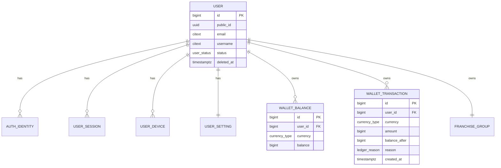
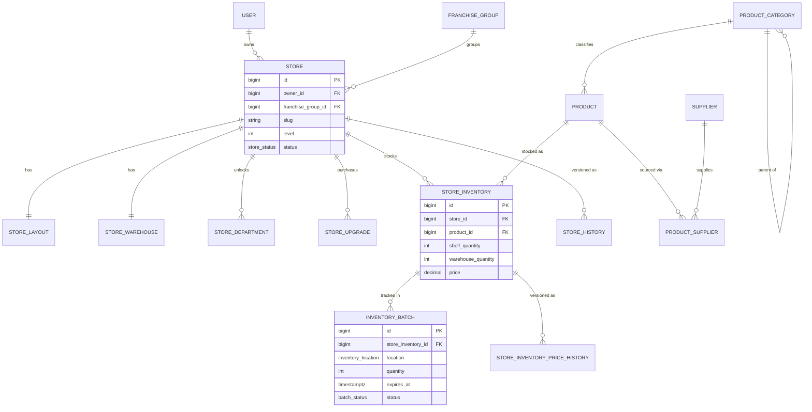
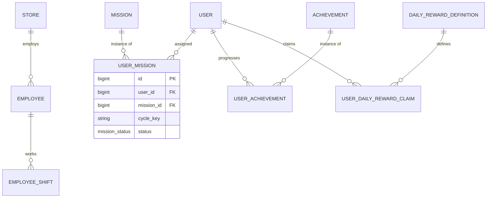
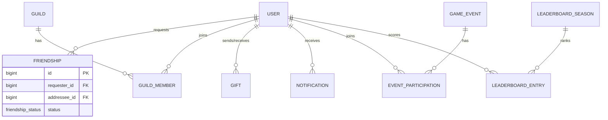
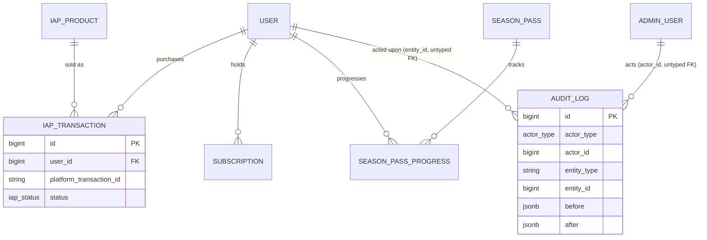

# MarketVerse — Production Database Design

**Companion to:** [PRD.md](./PRD.md) · [FEATURE_LIST.md](./FEATURE_LIST.md) · [../prisma/schema.prisma](../prisma/schema.prisma)
**Status:** Draft v1.0
**Engine:** PostgreSQL 15+
**ORM:** Prisma 5+
**Scale target:** Millions of registered users, tens of thousands of concurrent sessions, low-thousands write TPS sustained on the hottest tables (wallet ledger, store inventory)

---

## 1. Design Principles

1. **Server-authoritative, ledger-first economy.** No currency value is ever trusted from the client; every balance change is a row in `wallet_transactions` before it is a number anywhere else (PRD §7, §18.4).
2. **Normalize by default, denormalize by exception.** Every denormalization below is named and justified (§5) — never silent.
3. **Soft delete for anything referenced elsewhere; hard delete only for true leaves** (sessions, expired batches). See §7.
4. **History is structural, not incidental.** Two distinct mechanisms — a generic `audit_logs` trail and per-entity `*_history` temporal tables — serve different query needs (§9).
5. **Design for horizontal read scale before horizontal write scale.** At MarketVerse's expected shape (many reads per player session, comparatively few writes), a single well-indexed, partitioned, replicated Postgres primary comfortably covers "millions of users" — see §12 for the math and the escape hatch if that ever stops being true.
6. **Everything Prisma can't express is still designed, just implemented in raw SQL migrations** (partial indexes, `CHECK` constraints, triggers, partitioning, BRIN indexes). This doc is the source of truth for those; `schema.prisma` links back here at every such point.

---

## 2. Naming Conventions

| Element | Convention | Example |
|---|---|---|
| Table names | `snake_case`, plural | `store_inventory`, `wallet_transactions` |
| Prisma model names | `PascalCase`, singular | `StoreInventory`, `WalletTransaction` |
| Column names | `snake_case` | `created_at`, `store_id` |
| Prisma field names | `camelCase` | `createdAt`, `storeId` |
| Primary key | Always `id`, `BigInt` (`bigserial`) | `id` |
| Public/external ID | `public_id`, `Uuid`, on every aggregate root | `public_id` |
| Foreign key | `<singular_referenced_table>_id` | `user_id`, `store_id` |
| Boolean columns | `is_`/`has_` prefix | `is_active`, `is_secret` |
| Timestamps | `created_at`, `updated_at`, `deleted_at` (timestamptz) | — |
| Junction/pivot tables | `<owner>_<owned>` | `guild_members`, `product_suppliers` |
| History tables | `<table>_history` | `store_history` |
| Enum DB type | `snake_case`, `@@map`'d | `user_status`, `ledger_reason` |
| Enum values | `SCREAMING_SNAKE_CASE` | `ACTIVE`, `IN_PROGRESS` |
| Indexes | `idx_<table>_<col[_col…]>` | `idx_wallet_transactions_user_id_created_at` |
| Unique constraints | `uq_<table>_<col[_col…]>` | `uq_store_inventory_store_id_product_id` |
| Foreign key constraints | `fk_<table>_<ref_table>` | `fk_stores_users` |
| Check constraints | `chk_<table>_<rule>` | `chk_wallet_balances_non_negative` |

Prisma auto-generates most constraint/index names; the raw-SQL migrations in §6/§8/§9 name theirs explicitly per this table since they aren't Prisma-managed.

---

## 3. Entity-Relationship Diagrams

Split by domain for readability — the full schema is ~45 tables. Cardinalities: `||--o{` one-to-many, `||--||` one-to-one, `}o--o{` many-to-many (via join table, shown explicitly).

### 3.1 Identity, Auth & Wallet



### 3.2 Store, Inventory, Warehouse, Products



### 3.3 Employees, Missions, Achievements, Daily Rewards



### 3.4 Social, Leaderboards, Notifications, Events



### 3.5 Monetization, Admin, Audit



> `audit_logs.actor_id` / `entity_id` are intentionally **not** real foreign keys — the table is polymorphic across `users`, `admin_users`, and every other entity type, which a single FK can't express. Integrity here is enforced at the application/service layer, not the database. This is the one place in the schema where that tradeoff is made deliberately (see §5).

---

## 4. Relations & Referential Actions

| Relationship | Cardinality | `onDelete` | Rationale |
|---|---|---|---|
| `User → Store` (owner) | 1:N | `Restrict` | A user with stores can't be hard-deleted; use `deletedAt` instead (GDPR erasure is a separate anonymization job, not a `DELETE`). |
| `Store → StoreLayout/StoreWarehouse/StoreDepartment/StoreUpgrade` | 1:1 / 1:N | `Cascade` | True dependent children with no independent lifecycle. |
| `Store → StoreInventory` | 1:N | `Cascade` | Inventory rows are meaningless without the store. |
| `StoreInventory → InventoryBatch` | 1:N | `Cascade` | Batches are owned entirely by their inventory row. |
| `User → WalletTransaction` | 1:N | `Restrict` | Ledger rows must never disappear, even in theory. |
| `Product → StoreInventory` | 1:N | `Restrict` | A product referenced by live inventory can't be hard-deleted; use `isActive`/`deletedAt`. |
| `Mission/Achievement → User*` join rows | 1:N | `Cascade` | Deleting the *definition* (rare, admin-only) cascades its per-user progress rows. |
| `User → UserSession/UserDevice/AuthIdentity` | 1:N | `Cascade` | Pure session/auth artifacts, safe to hard-delete with the user's auth record. |
| `Guild → GuildMember` | 1:N | `Cascade` | Membership has no meaning without the guild. |

General rule: **`Cascade` only where the child is inert without the parent and carries no independent audit/financial value. `Restrict` everywhere money, ownership, or historical integrity is involved.** Nothing in this schema uses `onDelete: Cascade` from `User` for financial or store-of-record data — soft delete (§7) is the only supported "remove my account" path.

---

## 5. Normalization

Baseline target is **3NF** across the schema. Every table has a single-column surrogate key, all non-key attributes depend on the whole key, and there are no transitive dependencies (e.g., `Store` doesn't duplicate `owner.email`; `StoreInventory` doesn't duplicate `product.name`).

**Named exceptions** (deliberate denormalization, each justified by a specific access pattern):

| Table / Column | What's denormalized | Why |
|---|---|---|
| `store_layouts.layout_data` (jsonb) | Grid/cell placement blob instead of a `store_layout_cells` row-per-cell table | Layout is always read and written as one atomic unit (never queried cell-by-cell); a normalized version would be thousands of rows per store for no query benefit. GIN-indexed if cell-level search is ever needed (§6). |
| `store_inventory.shelf_quantity` / `warehouse_quantity` | Cached aggregate of `SUM(inventory_batches.quantity)` | This is the single hottest read in the game (every shelf-state check, every storefront render). Recomputing via `SUM()` on every read doesn't scale; batches remain the source of truth for FIFO/expiry logic, and quantities are updated transactionally in the same statement that inserts/updates a batch. |
| `wallet_balances.balance` | Cached running total of `wallet_transactions` | Classic ledger + balance-cache pattern. The ledger is authoritative and replayable; the balance column exists purely so "what's my balance" doesn't require summing a multi-million-row table. A nightly reconciliation job re-derives balances from the ledger and alerts on drift. |
| `leaderboard_entries` | Fully derived table, recomputed from `stores`/`wallet_balances` on a schedule (not live-queried) | Leaderboards are read orders of magnitude more than they change meaningfully; materializing on a cron/job beats computing `ORDER BY` across millions of stores per page view. |
| `store_history` / `store_inventory_price_history` | Full-row snapshots duplicating the live table | Intentional — that's what a history table *is* (§9). Not a normalization violation so much as its purpose. |

No other table stores derived or duplicated data. `Json`/`jsonb` fields (`missions.requirements`, `missions.reward`, `game_events.config`, etc.) hold genuinely schema-flexible, admin-authored config — not relational data forced into a blob to avoid modeling it.

---

## 6. Indexes

**Rules applied throughout `schema.prisma`:**
- Every foreign key column is indexed (either alone or as the leading column of a composite index) — Postgres does not do this automatically, unlike some other databases.
- Composite indexes put the **equality-filtered column first**, the **range/sort column last** — e.g. `(user_id, created_at)` on `wallet_transactions` supports "this user's transactions, newest first" without a sort step.
- Unique constraints double as lookup indexes; no redundant plain index is added on top of a unique one.

**Beyond what Prisma's DSL can express** (added via raw SQL in `prisma/migrations/`):

```sql
-- Partial unique indexes: true uniqueness only among *active* (non-soft-deleted) rows.
-- Lets a deleted account's email/username be reclaimed by a new registration.
CREATE UNIQUE INDEX CONCURRENTLY uq_users_email_active
    ON users (email) WHERE deleted_at IS NULL;

CREATE UNIQUE INDEX CONCURRENTLY uq_users_username_active
    ON users (username) WHERE deleted_at IS NULL;

CREATE UNIQUE INDEX CONCURRENTLY uq_stores_slug_active
    ON stores (slug) WHERE deleted_at IS NULL;

CREATE UNIQUE INDEX CONCURRENTLY uq_guilds_name_active
    ON guilds (name) WHERE deleted_at IS NULL;

-- GIN index for containment/path queries against mission requirement configs.
CREATE INDEX CONCURRENTLY idx_missions_requirements_gin
    ON missions USING GIN (requirements jsonb_path_ops);

-- GIN index for admin/debug queries against store layout blobs.
CREATE INDEX CONCURRENTLY idx_store_layouts_data_gin
    ON store_layouts USING GIN (layout_data jsonb_path_ops);

-- BRIN indexes on huge, naturally time-ordered append-only tables: a few KB
-- each vs. hundreds of MB for an equivalent B-tree, ideal for range scans
-- ("all transactions in March") on physically sequential data.
CREATE INDEX CONCURRENTLY idx_wallet_transactions_created_at_brin
    ON wallet_transactions USING BRIN (created_at) WITH (pages_per_range = 32);

CREATE INDEX CONCURRENTLY idx_audit_logs_created_at_brin
    ON audit_logs USING BRIN (created_at) WITH (pages_per_range = 32);

-- Trigram index to support fuzzy/typeahead store & product name search.
CREATE EXTENSION IF NOT EXISTS pg_trgm;
CREATE INDEX CONCURRENTLY idx_stores_name_trgm
    ON stores USING GIN (name gin_trgm_ops);
CREATE INDEX CONCURRENTLY idx_products_name_trgm
    ON products USING GIN (name gin_trgm_ops);
```

`CONCURRENTLY` is used throughout so index builds never block writes on live tables — required at this scale; never build an index the normal way against a production-sized table.

---

## 7. Constraints

**Expressed natively in `schema.prisma`:** `@id`, `@unique`, `@@unique`, `@relation` foreign keys, `NOT NULL` (Prisma's default for non-`?` fields), enum types.

**`CHECK` constraints** are not yet expressible in the Prisma schema DSL, so all of them live in raw-SQL migrations:

```sql
ALTER TABLE wallet_balances
    ADD CONSTRAINT chk_wallet_balances_non_negative CHECK (balance >= 0);

ALTER TABLE store_inventory
    ADD CONSTRAINT chk_store_inventory_quantities_non_negative
        CHECK (shelf_quantity >= 0 AND warehouse_quantity >= 0);

ALTER TABLE store_inventory
    ADD CONSTRAINT chk_store_inventory_price_positive CHECK (price > 0);

ALTER TABLE products
    ADD CONSTRAINT chk_products_cost_price_positive
        CHECK (base_cost > 0 AND base_price > 0);

ALTER TABLE inventory_batches
    ADD CONSTRAINT chk_inventory_batches_quantity_positive CHECK (quantity >= 0);

ALTER TABLE employees
    ADD CONSTRAINT chk_employees_morale_range CHECK (morale BETWEEN 0 AND 100);

ALTER TABLE stores
    ADD CONSTRAINT chk_stores_reputation_range CHECK (reputation_stars BETWEEN 0 AND 5);

ALTER TABLE guild_members
    ADD CONSTRAINT chk_guild_members_not_self_owner_conflict CHECK (TRUE); -- example placeholder for role-invariant checks enforced at app layer

ALTER TABLE friendships
    ADD CONSTRAINT chk_friendships_no_self_friend CHECK (requester_id <> addressee_id);
```

### 7.1 Soft Delete

**Pattern:** a nullable `deleted_at timestamptz` column on every entity that (a) a user or admin can remove, and (b) other rows may still legitimately reference after removal (orders, ledger entries, history rows, social graph).

Rules:
- Application code **never** issues `DELETE` against these tables. A "delete" is `UPDATE … SET deleted_at = now()`.
- All default Prisma queries in the service layer go through a query-extension/middleware that injects `WHERE deleted_at IS NULL` automatically, so soft-deleted rows don't silently leak into normal reads. Explicit "include deleted" is an opt-in parameter for admin tooling only.
- True uniqueness (email, username, store slug, guild name) is scoped to *active* rows only, via the partial unique indexes in §6 — otherwise a deleted account would permanently squat a username.
- Hard deletes are reserved for rows with **zero** downstream referential or historical value: expired `user_sessions`, `discarded` `inventory_batches` past a retention window, and old partitions dropped wholesale (§8) rather than row-deleted.
- GDPR "right to erasure" is handled as a distinct **anonymization job** (scrubs `email`, `username`, `display_name`, `avatar_url` to tombstone values and sets `deleted_at`) rather than a real `DELETE`, since the row is load-bearing for `stores.owner_id`, `wallet_transactions.user_id`, etc. This is a deliberate legal/technical tradeoff: erasure of PII, not erasure of the row.

Tables carrying `deleted_at`: `users`, `stores`, `products`, `employees`, `guilds`, `admin_users`.

---

## 8. Partitioning & Migration-Managed Tables

Four tables are high-volume, append-mostly, and naturally time-ordered — strong partitioning candidates. Prisma has no concept of native table partitioning, so these are declared as ordinary models in `schema.prisma` (for type-safe client access) but their **physical partitioning DDL is authored by hand** in a dedicated migration, and Prisma's drift detection is told to treat that migration as already-applied baseline going forward.

**Partitioned tables:** `wallet_transactions`, `audit_logs`, `notifications`, `store_inventory_price_history`.

```sql
-- Example: wallet_transactions, RANGE partitioned by month on created_at.
-- Run once, by hand, as the initial migration for this table (before any
-- app traffic), then automated monthly partition creation takes over (below).

CREATE TABLE wallet_transactions (
    id             bigserial,
    public_id      uuid        NOT NULL DEFAULT gen_random_uuid(),
    user_id        bigint      NOT NULL REFERENCES users (id),
    currency       currency_type NOT NULL,
    amount         bigint      NOT NULL,
    balance_after  bigint      NOT NULL,
    reason         ledger_reason NOT NULL,
    reference_type varchar,
    reference_id   bigint,
    created_at     timestamptz NOT NULL DEFAULT now(),
    PRIMARY KEY (id, created_at)          -- partition key must be part of every unique/PK constraint
) PARTITION BY RANGE (created_at);

CREATE TABLE wallet_transactions_2026_07 PARTITION OF wallet_transactions
    FOR VALUES FROM ('2026-07-01') TO ('2026-08-01');
CREATE TABLE wallet_transactions_2026_08 PARTITION OF wallet_transactions
    FOR VALUES FROM ('2026-08-01') TO ('2026-09-01');
-- … one per month, automated via pg_partman from here on:

CREATE EXTENSION IF NOT EXISTS pg_partman;
SELECT partman.create_parent(
    p_parent_table => 'public.wallet_transactions',
    p_control      => 'created_at',
    p_type         => 'range',
    p_interval     => '1 month',
    p_premake      => 3          -- keep 3 months of future partitions pre-created
);
```

**Retention/archival policy:**

| Table | Hot (fast storage, indexed) | Cold (archived) |
|---|---|---|
| `wallet_transactions` | 18 months | Older partitions `COPY`'d to object storage (Parquet/CSV) then `DETACH PARTITION` + drop — never bulk `DELETE` |
| `audit_logs` | 12 months | Same detach-and-archive pattern; compliance may require longer retention in cold storage |
| `notifications` | 90 days | Dropped outright after archival cutoff (low long-term value) |
| `store_inventory_price_history` | 24 months | Archived for economy-analytics reprocessing |

`pg_partman`'s background worker (or a scheduled job calling `partman.run_maintenance_proc()`) creates future partitions and detaches expired ones automatically — this must never be manual toil.

**Prisma workflow for partitioned tables:** the model is defined normally in `schema.prisma` for the TypeScript client; the initial `CREATE TABLE … PARTITION BY RANGE` migration is written by hand (via `prisma migrate dev --create-only`, then edited) and *not* regenerated by `prisma migrate diff` afterward — subsequent `ALTER TABLE` changes to these models go through the same hand-edit process so Prisma never attempts to "fix" the partitioned structure back into a plain table.

---

## 9. Audit Tables vs. History Tables

These solve two different problems and are kept deliberately separate:

| | `audit_logs` (generic) | `*_history` (per-entity, e.g. `store_history`) |
|---|---|---|
| Question it answers | *"Who did what, when, across the whole system?"* | *"What did this specific row look like at time T?"* |
| Shape | Polymorphic: one row per mutation, `entity_type` + `entity_id` + `before`/`after` JSON diff | Typed: full-column snapshot per version, same shape as the live table |
| Populated by | Application service layer (explicit write on every sensitive mutation: admin actions, currency adjustments, account status changes) | Database trigger (automatic, can't be bypassed by application bugs) |
| Retention | 12 months hot / archived (§8) | Matches business need for the specific entity (e.g., pricing history kept 24 months for economy analytics) |
| Used for | Security investigation, support tickets, compliance ("show me every admin action on this account") | Analytics/reporting, reconstructing "store state as of last Tuesday," powering the Analytics dashboards (PRD §9) |

### 9.1 Audit log — write pattern (application-level)

Every admin-panel mutation and every sensitive player-triggered mutation (currency adjustment, account suspension, refund) writes an `audit_logs` row in the **same transaction** as the mutation itself — never as an async afterthought, so audit and reality can't drift.

### 9.2 History tables — trigger pattern (database-level)

Illustrated for `stores` (the same pattern is replicated for `store_inventory` pricing via `store_inventory_price_history`):

```sql
CREATE OR REPLACE FUNCTION fn_store_history_track() RETURNS TRIGGER AS $$
BEGIN
    IF (TG_OP = 'UPDATE') THEN
        -- Close out the previous version's validity window.
        UPDATE store_history
           SET valid_to = now()
         WHERE store_id = OLD.id AND valid_to IS NULL;

        INSERT INTO store_history
            (store_id, operation, name, level, reputation_stars, status, changed_by, valid_from, valid_to)
        VALUES
            (NEW.id, 'UPDATE', NEW.name, NEW.level, NEW.reputation_stars, NEW.status::text,
             current_setting('app.current_user_id', true)::bigint, now(), NULL);
        RETURN NEW;

    ELSIF (TG_OP = 'INSERT') THEN
        INSERT INTO store_history
            (store_id, operation, name, level, reputation_stars, status, changed_by, valid_from, valid_to)
        VALUES
            (NEW.id, 'INSERT', NEW.name, NEW.level, NEW.reputation_stars, NEW.status::text,
             current_setting('app.current_user_id', true)::bigint, now(), NULL);
        RETURN NEW;

    ELSIF (TG_OP = 'DELETE') THEN
        UPDATE store_history
           SET valid_to = now()
         WHERE store_id = OLD.id AND valid_to IS NULL;
        RETURN OLD;
    END IF;
END;
$$ LANGUAGE plpgsql;

CREATE TRIGGER trg_store_history
    AFTER INSERT OR UPDATE OR DELETE ON stores
    FOR EACH ROW EXECUTE FUNCTION fn_store_history_track();
```

`current_setting('app.current_user_id', true)` is set per-request by the application (`SET LOCAL app.current_user_id = '123'` at the start of each transaction) so the trigger can attribute changes without the app having to write history rows itself — this is what makes it tamper-resistant against application bugs (a broken service method can forget to log an audit entry; it cannot bypass a trigger).

New entities that need row-level history follow this exact template: a `<table>_history` table with the same business columns + `operation`, `valid_from`, `valid_to`, `changed_by`, plus a `fn_<table>_history_track()` trigger function.

---

## 10. Migration Strategy

**Tooling:** Prisma Migrate, with `directUrl` (bypassing PgBouncer) for all DDL, since transaction-pooled connections don't support the session-level features (advisory locks, prepared statements) migrations rely on.

**Workflow:**

1. **Local dev:** `prisma migrate dev` — generates and applies migrations, keeps the shadow database in sync, regenerates the Prisma Client.
2. **Anything Prisma can't express natively** (partitioning, triggers, `CHECK` constraints, partial/BRIN/trigram indexes): `prisma migrate dev --create-only`, then hand-edit the generated `migration.sql` before applying. These migrations are flagged with a `-- MANUAL:` comment header so reviewers know not to expect them to match the Prisma schema diff 1:1.
3. **CI:** `prisma migrate diff --from-migrations ./prisma/migrations --to-schema-datamodel ./prisma/schema.prisma --exit-code` — fails the build if the schema and migration history have drifted apart.
4. **Production deploy:** `prisma migrate deploy` only — never `migrate dev` against production. Runs as a pre-deploy pipeline step, gated on a passing staging run against a production-sized data snapshot.

**Zero-downtime schema changes (expand/contract):** every backward-incompatible change (renaming/dropping a column, tightening a constraint, changing a type) ships across **three separate deploys**, never one:

1. **Expand:** add the new column/table as nullable/optional; deploy application code that writes to *both* old and new.
2. **Backfill:** a batched background job (never a single locking `UPDATE … SET` on a multi-million-row table) migrates historical rows; application reads from the new shape once backfill completes.
3. **Contract:** a follow-up migration adds `NOT NULL`/drops the old column, once no code path references it. `NOT NULL` is added via `ALTER TABLE … ADD CONSTRAINT … NOT NULL NOT VALID` followed by `VALIDATE CONSTRAINT` in a separate statement, so the table isn't locked for a full scan in one step.

**Rollback:** forward-only. Prisma Migrate does not generate down-migrations, and hand-maintained down-scripts rot faster than they're used correctly under incident pressure. The standard response to a bad migration is a new corrective migration, not a revert. Exception: any migration classified `-- MANUAL:` (§10.2) with real risk (large table rewrite, partition change) requires a tested rollback script committed alongside it *before* it merges, per the review checklist.

**Review checklist for every migration PR:**
- [ ] Does it lock a large table for more than a few ms? (`ALTER TABLE ADD COLUMN … DEFAULT` on Postgres 11+ is fine; `ADD COLUMN … NOT NULL DEFAULT <non-constant>` is not — check.)
- [ ] Are new indexes built `CONCURRENTLY`?
- [ ] Does it touch a partitioned table? If so, was it hand-authored per §8, not autogenerated?
- [ ] Is there a tested rollback path, if `-- MANUAL:`?
- [ ] Has it been run against a staging snapshot at realistic row counts?

---

## 11. Setup / Extensions Required

```sql
CREATE EXTENSION IF NOT EXISTS citext;     -- case-insensitive email/username
CREATE EXTENSION IF NOT EXISTS pg_trgm;    -- fuzzy/typeahead name search
CREATE EXTENSION IF NOT EXISTS pg_partman; -- automated partition maintenance
CREATE EXTENSION IF NOT EXISTS pg_stat_statements; -- query performance monitoring
-- gen_random_uuid() is built into PostgreSQL core since v13; no pgcrypto needed.
```

### 11.1 Client & Migrate Connection Setup

`schema.prisma` targets Prisma 7 (confirmed against the CLI: schema validates and formats clean under `prisma@7.9.1`). Prisma 7 removed `url`/`directUrl` from the `datasource` block in the schema file itself — connection strings now live in **`prisma.config.ts`** (repo root, used by Migrate/Studio) and are supplied to the runtime `PrismaClient` separately. Three small files at the repo root implement this:

| File | Purpose |
|---|---|
| [`prisma.config.ts`](../prisma.config.ts) | Read by `prisma migrate dev`/`deploy`/`studio`. Points Migrate at `DIRECT_DATABASE_URL` (falling back to `DATABASE_URL`) — DDL always goes over the direct, unpooled connection per §10. |
| [`.env.example`](../.env.example) | Documents the two required connection strings: pooled `DATABASE_URL` (app runtime, via PgBouncer) and direct `DIRECT_DATABASE_URL` (Migrate only). Copy to `.env` and fill in real credentials — never commit `.env`. |
| [`package.json`](../package.json) | Pins `prisma`/`@prisma/client` to the validated `7.9.1` line and exposes `db:*` scripts (`validate`, `format`, `migrate:dev`, `migrate:deploy`, `generate`, `studio`) so the workflow in §10 has concrete commands. |

Run `npm install` once these are in place, then `npm run db:validate` to confirm the schema still parses against whatever Prisma version is actually installed — schema/tooling versions drift over a project's lifetime, so this is worth keeping in CI (§10's drift-check step) rather than trusting it once.

---

## 12. Performance Optimizations at Scale

**Sizing the problem first:** "millions of users" for a session-based simulation game is not a continuous-write firehose — it's high *read* concurrency (store views, inventory checks, leaderboard fetches) with comparatively bursty writes (a sale, a restock, a mission claim). A single modern Postgres primary handles tens of thousands of read QPS and low-thousands write TPS when properly indexed; that comfortably covers this workload without sharding. The plan below scales in stages, only reaching for more exotic tools when the simpler stage is proven insufficient.

**Stage 1 — Single well-tuned primary (covers most of Year 1):**
- Every hot query backed by an index matching its actual predicate + sort (§6); `EXPLAIN ANALYZE` review is part of the migration PR checklist (§10).
- `autovacuum_vacuum_scale_factor` lowered (e.g., `0.02` instead of the `0.2` default) on high-churn tables — `wallet_balances`, `store_inventory`, `leaderboard_entries` — so they're vacuumed far more often than Postgres's defaults assume, preventing bloat on tables that update the same rows constantly.
- Keyset/cursor pagination (`WHERE id > $cursor ORDER BY id LIMIT 50`) everywhere, never `OFFSET`, for any list that can grow past a page — `OFFSET` degrades linearly with depth on large tables.
- Batched writes (`createMany`, `$transaction`) for bulk operations: daily mission resets, leaderboard recomputation, spoilage sweeps.
- Connection pooling via **PgBouncer in transaction mode** in front of Postgres; the app's `DATABASE_URL` points at the pooler, `DIRECT_DATABASE_URL` (session-level, unpooled) is reserved for migrations only (§10).

**Stage 2 — Read scaling (once read QPS outgrows one primary):**
- Async streaming **read replicas**; route analytics dashboards, leaderboard reads, and store-visiting (social) queries to a replica via a read/write-splitting Prisma extension or a dedicated read-only client instance. Accept eventual consistency (typically sub-second lag) for these non-authoritative reads — never for wallet balance checks or inventory writes, which always hit the primary.
- **Redis** as a read-through cache in front of the three hottest, most-repeated reads: active session/auth lookups, computed leaderboard pages, and per-store inventory snapshots (short TTL, invalidated on write). This offloads repeat reads from Postgres entirely rather than just making Postgres reads faster.
- **Materialized views**, refreshed on a schedule (`REFRESH MATERIALIZED VIEW CONCURRENTLY`), for admin/analytics dashboards (PRD §9) that aggregate across millions of rows — never computed live against `wallet_transactions` or `store_inventory` on every dashboard load.

**Stage 3 — Write scaling (only if a specific table's write throughput genuinely becomes the bottleneck):**
- Partitioning (§8) already isolates hot recent data from cold history for `wallet_transactions`/`audit_logs`, which is usually sufficient — partitioned tables keep indexes small and vacuum cheap even at billions of historical rows.
- If write throughput on the ledger itself becomes the limiting factor (not expected below tens of millions of *daily active* users), the documented escape hatch is **Citus** (distributed Postgres, sharded by `user_id` — every hot table in this schema already has `user_id` or a `user_id`-reachable column as a natural shard key) rather than a rewrite to a different database engine. This is explicitly a *future* evolution path, not a Year-1 requirement — called out here so the schema's shard-key-friendly shape (§2's FK convention) isn't accidentally designed away later.

**Monitoring:** `pg_stat_statements` enabled from day one (§11); alerting on sequential-scan growth on tables above a row-count threshold, replication lag, autovacuum lag, and partition-creation job health (a failed `pg_partman` run silently degrades performance weeks later, not immediately — needs its own alert).

---

## 13. Summary — What Lives Where

| Concern | Mechanism | Section |
|---|---|---|
| Prevent lost/duplicate currency | Append-only ledger + reconciled cached balance | §5, §8 |
| Reclaim deleted usernames/emails | Partial unique indexes scoped to `deleted_at IS NULL` | §6, §7 |
| "Who changed this account and why" | `audit_logs` (app-written, polymorphic) | §9.1 |
| "What did this store look like last week" | `store_history` (trigger-written, typed) | §9.2 |
| Multi-month transaction/notification growth | Range partitioning + `pg_partman` + archive-then-detach | §8 |
| Zero-downtime schema changes | Expand → backfill → contract, three deploys | §10 |
| Millions of concurrent readers | Indexing discipline → replicas → Redis → materialized views | §12 |
| GDPR erasure vs. referential integrity | Anonymization job, not `DELETE` | §7 |

*End of Document — v1.0*
