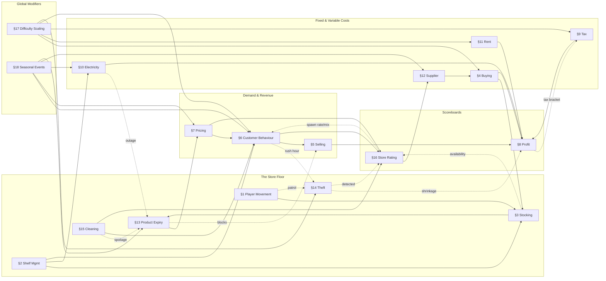

# MarketVerse — Gameplay Mechanics Design

**Companion to:** [PRD.md](./PRD.md) · [FEATURE_LIST.md](./FEATURE_LIST.md) · [DATABASE_DESIGN.md](./DATABASE_DESIGN.md) · [UI_UX_DESIGN.md](./UI_UX_DESIGN.md)
**Status:** Draft v1.0
**Author:** Senior Game Designer
**Scope:** Full mechanical specification for all 18 core gameplay systems, plus the causal web connecting them

---

## 0. Design Intent

Every mechanic below is a **lever in one economy**, not an isolated minigame. The test for whether a mechanic belongs in MarketVerse is: *does moving this lever visibly move at least two other levers?* If a system doesn't ripple, it's decoration, and MarketVerse doesn't have decoration — it has one running simulation the player is trying to read and steer.

Two numbers anchor every formula in this document so they compose consistently:

- **Time scale:** 1 in-game day = **20 real-world minutes**. Store hours run a defined portion of that day (configurable per store, default 07:00–22:00 game-time); night hours accelerate 4× for idle/offline players (per [DATABASE_DESIGN.md](./DATABASE_DESIGN.md)'s offline-earnings cap). This is what makes the [Day Summary screen](./UI_UX_DESIGN.md#1114-game-over--day-summary) a natural, roughly-once-per-session beat rather than an arbitrary cutoff.
- **Two scoreboards, everything else is an input:** every mechanic in this document feeds either **Profit** (§8) or **Store Rating** (§16), usually both. When you're deciding how a new mechanic should behave, ask which scoreboard it moves and check the [Interaction Map](#19-systems-interaction-map) rather than inventing a third success metric.

All dollar figures below are tuning defaults for a Level 1–10 store on the **Standard** difficulty preset (§17) — they scale with store level and difficulty exactly as specified in §17, not as separate hardcoded numbers per mechanic.

---

## 1. Player Movement

The player controls a single avatar walking the store floor — the same navmesh customers pathfind on (§6), so the player is a participant in their own store's traffic, not a floating cursor.

| Parameter | Value |
|---|---|
| Base walk speed | 3.2 tiles/sec |
| Hold-to-move (auto-path to clicked tile) | Default input; WASD direct control available |
| Sprint | Hold Shift, +40% speed, no cooldown/stamina — a convenience toggle, not a skill mechanic (no punishing resource per [PRD.md §2.2](./PRD.md#22-player-facing-goals)) |
| Carrying a stock box (§3 Stocking) | −25% speed |
| Interaction range | 1.5 tiles (shelf, register, employee, spill) |
| Collision | Solid vs. shelves/walls/registers; **soft** vs. customers and other avatars (slight overlap allowed) so foot traffic never hard-deadlocks an aisle |

**Dynamic interactions:**
- **Stocking (§3):** distance from warehouse to target shelf is real travel time, not an abstract timer — store layout quality directly affects restock throughput.
- **Theft (§14):** player presence within 3 tiles of a shelf reduces that shelf's theft roll — patrolling is a legitimate (optional) anti-shrinkage strategy.
- **Cleaning (§15):** mess tiles apply a local −20% speed penalty (a spill is slippery) and are the trigger for the manual clean interaction.
- **Customer Behaviour (§6):** the player is not pathing-invisible to customers — standing in a narrow aisle nudges customer routes exactly like another shopper would, which is a deliberate touch of physical presence, not a bug to "fix" with player-through-customer clipping.

---

## 2. Shelf Management

Shelves are placeable grid objects the player owns, arranges, and assigns.

| Parameter | Value |
|---|---|
| Footprint | 1×1 to 1×3 tiles, rotatable |
| Slots per standard shelf | 4, each bound to exactly one product SKU |
| Slot capacity | Product-defined stack size (typically 20 units) |
| Shelf types | Standard (ambient), Refrigerated (required for dairy/some perishables), Freezer, Produce Bin, Bakery Rack, Checkout Endcap |
| Reassigning a slot with stock | Player chooses: box remaining stock back to warehouse, or flag for clearance sale (§7) |
| Facing/visibility | Endcap and near-entrance placements have elevated visibility to the Impulse Buyer archetype (§6) |

**Dynamic interactions:**
- **Stocking (§3):** a shelf's type gates what can legally be placed in it — you cannot stock dairy on a Standard shelf, which is what makes Refrigerated shelf capacity a real planning constraint, not a cosmetic choice.
- **Electricity (§10):** Refrigerated/Freezer shelves are the dominant electricity draw in the store — shelf-type mix is an electricity-bill decision as much as a merchandising one.
- **Product Expiry (§13):** shelf type modifies effective shelf life (Refrigerated extends perishable life by 40% vs. leaving the same item on a Standard shelf, where applicable).
- **Store Rating (§16):** empty slots and a disorganized floor plan (via the Layout Efficiency Heatmap, [PRD.md §8.3](./PRD.md#83-layout-editor)) both depress the availability and ambience components of rating.
- **Customer Behaviour (§6):** shelf placement is literally the store's shopping-list pathing graph — a badly laid-out store makes every visit take longer, which burns patience (§6) before a customer even reaches checkout.

---

## 3. Stocking

The physical action of moving product from warehouse to shelf.

| Parameter | Value |
|---|---|
| Manual placement | 1.5 sec/unit, player-driven, tactile |
| Quick-Stock (default) | 3 sec flat per box (up to a full slot) regardless of quantity — faster for bulk, less granular |
| Carry capacity | 1 box = up to 20 units of one SKU; the **Cart** tool (Store Upgrade) holds 3 boxes at −15% move speed |
| FIFO order | Always pulls the oldest `inventory_batch` first — enforced by the system, not left to player memory (mirrors [DATABASE_DESIGN.md](./DATABASE_DESIGN.md) `InventoryBatch` FIFO design) |
| Stocker employee | Automates this at 3.5 sec/unit base, improving with employee level (§ [FEATURE_LIST.md §7](./FEATURE_LIST.md#7-employees)) |
| Overstock | Shelf-full remainder returns to warehouse automatically, no loss; warehouse-full at delivery forces the player to choose which SKU to reject or expedite-sell |

**Dynamic interactions:**
- **Product Expiry (§13):** FIFO is the whole point — stocking discipline is the primary lever a player has over waste.
- **Employee (Stocker):** automating this trades cash (wages) for player attention — the core "do it yourself vs. hire it out" tension of the mid-game.
- **Store Rating (§16):** an empty shelf slot for >2 minutes during open hours is logged as a stockout event, the single heaviest negative input to the availability component of rating.
- **Theft (§14):** stock sitting in the warehouse rather than on the (monitored) shop floor isn't exposed to shelf theft, but a warehouse with no Cleaner/security investment has its own smaller shrinkage roll — stocking too far ahead isn't a pure win.

---

## 4. Buying (Restocking from Suppliers)

Ordering new inventory — distinct from Selling (§5); this is the input side of the shelf.

| Parameter | Value |
|---|---|
| Order flow | Select product → supplier tier (§12) → quantity → pay immediately (`SUPPLIER_PURCHASE` ledger debit) → truck arrives after lead time |
| Bulk discount | −5% at ≥50 units, −10% at ≥100, −15% at ≥200 (diminishing, non-stacking with clearance) |
| Auto-Reorder (unlockable automation) | Fires when `shelfQuantity + warehouseQuantity < reorderThreshold`, using the last-used supplier tier, capped by available cash — never overdrafts the store to auto-buy |
| Warehouse capacity check | An order that would exceed warehouse capacity at delivery time is capped to available space, with the difference refunded — never silently destroyed inventory |

**Dynamic interactions:**
- **Supplier (§12):** tier choice trades cost against lead time and freshness — the central buy-side decision.
- **Product Expiry (§13):** Premium-tier deliveries arrive fresher (longer remaining shelf life at time of delivery) — paying more for speed is also paying for less waste downstream.
- **Difficulty Scaling (§17):** base supplier costs are the primary lever difficulty pulls (§17 table).
- **Seasonal Events (§18):** event-exclusive SKUs are only orderable during their event window, and some events shift supplier cost for specific departments (Harvest Festival: produce cost −10%).

---

## 5. Selling

The point-of-sale flow, autonomous by default with an optional manual minigame.

| Parameter | Value |
|---|---|
| Autonomous flow | Customer picks item → walks to register → Cashier (or player, if unstaffed) scans → payment resolves → `PRODUCT_SALE` credit |
| Cashier scan time | 1.2 sec/item, improving with Cashier level |
| Manual checkout minigame | Optional, player-scans-in-rhythm for a small tip bonus; fully skippable, never required — a flourish, not a gate |
| Queue capacity per register | 6 customers; beyond that, arriving customers either wait outside (patience ticking, §6) or leave immediately if all registers are full |
| Tips | 0–8% of purchase total, scaled by the customer's final satisfaction score (§6) |
| Expired stock | Hard-blocked from sale server-side (never purchasable once `status = EXPIRED`, per [BACKEND_ARCHITECTURE.md §5](./BACKEND_ARCHITECTURE.md#5-services)'s server-authoritative economy) |

**Dynamic interactions:**
- **Customer Behaviour (§6):** queue length and wait time are the single biggest satisfaction lever at checkout — a second register or a leveled-up Cashier is often the highest-ROI purchase in the mid-game.
- **Pricing (§7):** the sale only happens if the customer's purchase-probability roll (driven by price fairness) succeeds — Selling is the resolution step of a decision Pricing set up.
- **Employee (Cashier):** throughput is directly staffing-bound; this is the clearest, most legible staffing decision in the game.
- **Store Rating (§16):** every completed sale contributes to the rolling satisfaction average; every abandoned queue contributes negatively.

---

## 6. Customer Behaviour

The AI driving every non-player shopper — the system most other mechanics ultimately serve.

**State machine:** `Enter → Browse → Decide → Queue → Checkout → Exit` (satisfied), with an `Abandon` transition available from any state once patience hits 0.

| Archetype | Max Patience | Notable behavior |
|---|---|---|
| Regular | 100 | Baseline shopping-list pathing |
| Bargain Hunter | 80 | Actively re-routes toward Clearance-tagged shelves (§7); high price-sensitivity |
| Impulse Buyer | 70 | ~12% chance per Endcap passed (§2) to add an unplanned item to cart |
| VIP | 130 | High tolerance for wait, zero tolerance for stockouts — a single unavailable list item can flip a VIP visit from high-tip to reputation-damaging |
| Difficult Customer | 60 | ~5% of visits trigger a Complaint event requiring Manager/player resolution within 30 sec or it dents rating |
| Rush Hour spawn | 50 | Spawns in waves; low individual patience, high volume — a throughput stress test, not an individual-satisfaction one |

**Patience decay:** −2/sec while queueing; −5/sec while actively searching a shelf that's out of stock.

**Purchase probability** (per considered item): `P = clamp(1 - 3 × max(0, priceRatio − 1) × 100, 0.10, 1.0)`, where `priceRatio = shelfPrice / fairPrice` (§7) — every 1% over fair price costs ~3 percentage points of purchase probability, floored at 10% (a customer will still occasionally buy an overpriced item, never guaranteed to refuse).

**Satisfaction score** (0–1, feeds tips, rating, and reputation stars):

```
satisfaction = 0.40 × availabilityScore   (% of shopping list actually found)
             + 0.30 × priceFairnessScore  (avg priceRatio across purchased items, inverted)
             + 0.20 × checkoutScore       (queue wait vs. this customer's patience budget)
             + 0.10 × ambienceScore       (current Cleanliness tier modifier, §15)
```

**Dynamic interactions:**
- **Pricing (§7) & Selling (§5):** the direct decision loop — every price the player sets is a probability distribution over Customer Behaviour outcomes, not a fixed sale.
- **Shelf Management (§2):** the shopping-list pathing graph and Impulse Buyer endcap-triggering both run on shelf placement.
- **Store Rating (§16):** customer spawn *rate* and archetype *mix* (more VIPs at high rating, more budget-conscious spawns at low rating) are themselves outputs of Store Rating — this is the game's primary positive-feedback loop, and also its primary risk of runaway snowballing without the dampeners in §16.
- **Theft (§14):** a customer whose patience dropped below 20 before abandoning has an elevated theft-flag roll on that visit — frustration has a dark-but-abstracted downstream cost.
- **Cleaning (§15):** the ambience component of satisfaction, and customers actively path around known mess tiles, adding small detours that cost patience.
- **Difficulty Scaling (§17) & Seasonal Events (§18):** both modulate patience baselines, archetype mix, and spawn volume directly.

---

## 7. Pricing

The player's primary lever over both revenue and satisfaction simultaneously — the core tension mechanic of the whole game.

| Parameter | Value |
|---|---|
| Fair price band | `basePrice ± 15%` at Level 1, narrowing with store level (§17) — customers get more price-literate as a store matures |
| Clearance flag | Auto-suggested (and player-triggerable) when price is cut ≥20% below `basePrice`; boosts Bargain Hunter routing priority and purchase probability, at the cost of margin |
| Price history | Every price change is recorded (`StoreInventoryPriceHistory`, per [DATABASE_DESIGN.md §9.2](./DATABASE_DESIGN.md#92-history-tables--trigger-pattern-database-level)) — feeds the Statistics screen's price-fairness trend |
| Surge tolerance | Some Seasonal Events (§18) temporarily widen the fair-price band for specific departments — customers forgive a price hike on gift-wrap during Holiday Rush that they'd punish in March |

**Dynamic interactions:**
- **Customer Behaviour (§6):** the direct input to the purchase-probability formula — this is the relationship the whole mechanic exists to create.
- **Product Expiry (§13):** Clearance pricing is the salvage mechanism for stock approaching expiry — a well-timed markdown converts a near-total loss into a discounted sale.
- **Profit (§8):** the margin lever, directly.
- **Store Rating (§16):** the price-fairness component is a *rolling average*, not instantaneous — a single clearance event doesn't tank rating, but sustained overpricing does.

---

## 8. Profit

Not a player input — the primary derived scoreboard, settled daily.

```
Profit(day) = Revenue − COGS − Wages − Rent − Electricity − Tax
```

- **Revenue:** sum of the day's `PRODUCT_SALE` credits (§5).
- **COGS:** sum of the day's `SUPPLIER_PURCHASE` debits attributable to sold units (weighted-average cost per the FIFO batch consumed, §3/§13).
- **Wages, Rent, Electricity, Tax:** settled as a batch at day-end (the trigger for the [Day Summary screen](./UI_UX_DESIGN.md#1114-game-over--day-summary)), each its own ledger reason (`WAGE_PAYMENT`, `RENT_PAYMENT`, `UTILITY_PAYMENT`, `TAX_PAYMENT`).
- **No hard-fail on negative profit** (per [PRD.md §2.2](./PRD.md#22-player-facing-goals) and §7.4): a sustained losing streak surfaces a gentle in-game "Financial Advisor" tip and unlocks Loan eligibility ([PRD.md §7.4](./PRD.md#74-loans--risk-mid-game-system)) rather than any penalty. The number is never hidden, including on a bad day — see §16's Day Summary reframing principle.

**Dynamic interactions:** Profit is the terminal node for every cost and revenue mechanic in this document (§3–§7, §9–§14, §18) — see the [Interaction Map](#19-systems-interaction-map) rather than a per-mechanic list here; almost every arrow in that graph eventually points at Profit or Store Rating.

---

## 9. Tax

A periodic, progressive levy on **net profit**, not revenue — so a high-volume, thin-margin store isn't punished disproportionately to a boutique, high-margin one.

**Weekly tax brackets** (Standard difficulty, applied to that week's cumulative net profit *before* tax, i.e., after COGS/wages/rent/electricity):

| Weekly net profit | Rate on the portion in this bracket |
|---|---|
| $0 – $500 | 0% |
| $500 – $2,000 | 8% |
| $2,000 – $5,000 | 12% |
| $5,000+ | 18% |

- Auto-deducted at week's end as a single `TAX_PAYMENT` ledger entry.
- **Soft consequence only:** if the tax bill would take the wallet negative, an overdraft grace of −$200 is allowed; going beyond that temporarily locks new Store Upgrade purchases (not gameplay itself) until resolved via revenue recovery or a Loan — never a fail state, never a debt-collection minigame.
- A **Bookkeeper** specialist hire or the "Tax Software" Store Upgrade reduces the effective rate by 2–4 points — a legitimate long-term investment, not a one-time fix.

**Dynamic interactions:**
- **Profit (§8):** direct input — tax is calculated *on* profit, so every other cost mechanic that lowers net profit also (correctly) lowers the tax bill.
- **Rent (§11) & Electricity (§10):** siblings in the operating-expense stack; all three settle at the same cadence.
- **Difficulty Scaling (§17):** bracket thresholds and rates are the sharpest difficulty knob in the game — see §17's table.
- **Employee & Store Upgrades:** the Bookkeeper/Tax Software mitigation path.

---

## 10. Electricity

A daily utility bill driven by active equipment load — the mechanic that makes shelf-type and upgrade choices have an ongoing cost, not just an upfront one.

```
DailyElectricityCost = ($0.15/unit) × (BaseDraw + Σ shelfDraw + Σ equipmentDraw + Σ upgradeDraw)
```

| Load source | Draw (units/hr) |
|---|---|
| Base store (lighting, HVAC) | 4.0 |
| Standard shelf | 0.2 |
| Refrigerated shelf | 2.0 |
| Freezer shelf | 3.5 |
| Register / kiosk (active hours) | 0.6 |
| Neon Storefront Signage (upgrade) | 1.5 (also boosts foot-traffic visibility — a deliberate cost/benefit knob) |

- **Efficiency upgrades** ("LED Lighting," "Energy-Efficient Compressors") cut relevant draw by 20–35%, permanently.
- **Outage risk:** a rare random event (mitigated by the "Backup Generator" upgrade) that spikes refrigerated-item spoilage for its duration — see §13.

**Dynamic interactions:**
- **Shelf Management (§2):** shelf-type mix *is* the electricity bill, mechanically — refrigeration is a cost decision, not just a merchandising one.
- **Product Expiry (§13):** outage events triple refrigerated spoilage rate for their duration.
- **Rent (§11), Tax (§9):** sibling operating expenses, same daily/weekly settlement cadence.
- **Seasonal Events (§18):** the Summer Heatwave event directly raises both cooling draw and outage probability.

---

## 11. Rent

A fixed recurring cost tied to store footprint — the core expansion-decision mechanic.

```
WeeklyRent = BaseRatePerTile ($8) × TileCount × LocationMultiplier
```

- **LocationMultiplier** increases with neighborhood tier when the player relocates/expands into a better-trafficked location (higher base customer spawn rate, higher rent — always a paired tradeoff, never a strict upgrade).
- Expanding floor space (buying tiles, a Store Upgrade) raises rent immediately at the next settlement — the central "is this expansion actually going to pay for itself" decision the whole mid-game revolves around.
- **Same soft-consequence model as Tax (§9):** an unpaid rent shortfall triggers an overdraft grace (−$300) and a temporary upgrade-purchase lock, never eviction or a fail state.

**Dynamic interactions:**
- **Shelf Management (§2), Warehouse capacity:** more tiles directly means more shelf/warehouse capacity potential — rent is the price of headroom.
- **Profit (§8), Tax (§9):** rent is deducted before net profit is computed for tax purposes — a real, not cosmetic, tax benefit to careful footprint management.
- **Difficulty Scaling (§17):** `BaseRatePerTile` is a primary difficulty-preset lever and also drifts up slightly with store level, creating the natural "tycoon squeeze" described in §17.

---

## 12. Supplier

The buy-side relationship system underlying Buying (§4).

| Tier | Cost multiplier | Lead time | Freshness bonus | Delivery reliability |
|---|---|---|---|---|
| Budget | ×0.85 | 12 real-min | +0% shelf life | 8% chance of a delayed delivery |
| Standard | ×1.0 | 6 real-min | +10% shelf life | 100% on-time |
| Premium | ×1.25 | 2 real-min | +25% shelf life | 100% on-time, priority restock during shortages |

- **Supplier Loyalty:** cumulative spend with a given supplier tier for a given product unlocks a permanent extra discount (+2% at $10k cumulative, +4% at $50k) — rewards committing to a supply chain rather than tier-hopping for marginal savings.
- Only unlocked above certain **Store Rating** thresholds does the Premium tier become available at all (§16) — reputation opens supply-chain options, not just customer volume.

**Dynamic interactions:**
- **Buying (§4):** the tier selection this mechanic exists to inform.
- **Product Expiry (§13):** the freshness-bonus lever directly.
- **Profit (§8):** the primary COGS lever.
- **Seasonal Events (§18):** Harvest Festival drops produce-supplier cost 10% storewide; Holiday Rush can trigger Budget-tier shortages (reliability drops to 65% during peak event weeks) as flavor-accurate supply-chain pressure.

---

## 13. Product Expiry

The perishability state machine underlying Warehouse and Inventory.

**States:** `FRESH` (>50% shelf life remaining) → `EXPIRING` (<50%, visually flagged, clearance-suggested) → `EXPIRED` (0%, hard-unsellable) → `DISCARDED` (removed, logged as waste).

- Non-perishables (`shelfLifeHours = null`) never leave `FRESH`.
- **FIFO consumption** (§3) is the primary player lever over waste — always sell/restock the oldest batch first, enforced by the system.
- **Spoilage-rate modifiers (multiplicative, stack):**

| Condition | Modifier |
|---|---|
| Refrigerated shelf vs. Standard (where applicable) | ×0.6 (40% slower) |
| Premium supplier freshness bonus | ×0.75–0.9 |
| Cleanliness tier "Neglected" or worse (§15) | ×1.1 |
| Electricity outage (§10) | ×3.0 (refrigerated items only, for outage duration) |
| Summer Heatwave event (§18) | ×1.25 (storewide, perishables) |

- Discarding a batch logs its cost as waste (visible in Statistics) — a distinct, trackable loss category from theft (§14), so a player can tell *which* problem they actually have.

**Dynamic interactions:**
- **Stocking (§3):** FIFO enforcement.
- **Selling (§5):** hard server-side sale block once `EXPIRED`.
- **Pricing (§7):** Clearance is the salvage path before total loss.
- **Cleaning (§15), Electricity (§10), Supplier (§12), Seasonal Events (§18):** all modify the spoilage rate directly, per the table above — Product Expiry is one of the most heavily-modified mechanics in the game, which is deliberate: it's the clock that makes inventory planning matter.

---

## 14. Theft

Shrinkage — inventory loss with no accompanying sale, silent unless mitigated.

```
TheftRoll(customer, shelf) = 1.5%
  + 3%  if store is in a Rush Hour high-density state (§6)
  − 2%  per active Security Camera covering this shelf's zone
  − 4%  if a Security Guard specialist is stationed within the zone
  − 1%  if the player avatar is within 3 tiles (§1)
  + 2%  if this customer's patience was < 20 at any point this visit (§6)
```

- A **detected** theft (camera coverage converts a fraction of attempts into "caught" events) gives a small, real Store Rating bump — visible security reassures honest customers — while an **undetected** theft is silent inventory shrinkage: no ledger transaction, just a quantity reduction logged to the Statistics screen's dedicated **Shrinkage** stat, so the player can *notice* the problem and *choose* to address it, rather than it being invisible.
- No theft event is ever framed as the player's fault or shown as a punitive interruption — it surfaces as a weekly Statistics line, consistent with [PRD.md §2.2](./PRD.md#22-player-facing-goals)'s no-punishing-mechanics stance.

**Dynamic interactions:**
- **Customer Behaviour (§6):** Rush Hour density and low-patience frustration are the two behavioral drivers.
- **Store Upgrades (Security Camera), Employee (Security Guard specialist):** the two direct mitigation investments, each with its own cost (upgrade price or wage) traded against expected shrinkage — a legible ROI decision once the Statistics shrinkage line exists.
- **Player Movement (§1):** patrol presence is a zero-cost (attention-cost only) deterrent, available from minute one before any upgrade is affordable.
- **Store Rating (§16):** detected theft is a (small) positive input; undetected theft only hurts via Profit, not directly via rating — theft you don't know about doesn't unfairly tank your reputation, only your margin.

---

## 15. Cleaning

Store cleanliness as a decaying resource the player and Cleaner employees actively maintain.

| Cleanliness tier | Range | Satisfaction modifier | Spoilage modifier |
|---|---|---|---|
| Pristine | 90–100 | +10% | ×1.0 |
| Clean | 70–89 | +5% | ×1.0 |
| Adequate | 40–69 | 0% | ×1.0 |
| Neglected | 15–39 | −10% | ×1.1 |
| Filthy | 0–14 | −25% | ×1.1 |

- **Messes** spawn from: customer foot traffic (small per-customer chance of litter), produce/dairy handling spills (scaled by traffic), rare restocking mishaps. Each active, unaddressed mess drains the store's cleanliness score −2/min (capped).
- **Resolution:** player manual clean (2 sec interaction, §1); Cleaner employee auto-resolves messes within their patrol radius over time; the "Auto-Mop System" Store Upgrade passively restores cleanliness even with no Cleaner staffed.

**Dynamic interactions:**
- **Customer Behaviour (§6):** the ambience component of satisfaction, plus active pathing avoidance of known mess tiles (a small but real patience cost).
- **Product Expiry (§13):** the Neglected/Filthy spoilage-rate penalty.
- **Store Rating (§16):** a direct weighted component.
- **Employee (Cleaner), Store Upgrades (Auto-Mop):** the two staffing/capital paths to maintaining this without constant player attention.
- **Player Movement (§1):** mess tiles apply a local speed penalty and are the manual-clean interaction trigger.

---

## 16. Store Rating

The aggregate reputation scoreboard (`stores.reputationStars`, 0–5★) — Profit's twin.

```
Rating = 0.40 × AvgSatisfaction(7d)      (§6)
       + 0.20 × AvgCleanliness(7d)       (§15)
       + 0.20 × StockAvailability(7d)    (inverse of stockout rate, §2/§3)
       + 0.10 × PriceFairness(7d)        (§7)
       + 0.10 × IncidentModifiers        (detected-theft bumps §14, unresolved-complaint and VIP-disappointment penalties §6)
```

A 7-day rolling window, recalculated on the same cadence as leaderboard recompute (matches the [DATABASE_DESIGN.md §5](./DATABASE_DESIGN.md#5-normalization) derived-table pattern) — and it **decays slowly toward the current rolling average with no player activity**, so a store can't coast indefinitely on a historical peak.

**Rating thresholds (the game's primary positive-feedback loop, deliberately dampened):**

| Threshold | Unlocks |
|---|---|
| 3.0★ | Premium supplier tier access (§12) |
| 4.0★ | +15% customer spawn rate; VIP archetype becomes spawn-eligible (§6) |
| 4.5★ | Franchise / second-location eligibility ([PRD.md §6.4](./PRD.md#64-prestige--franchise-system)) |
| <2.0★ | −20% spawn rate, new department unlocks paused until recovered — a soft, fully recoverable consequence, never a fail state |

**Dynamic interactions:** Store Rating is a terminal node for §2, §6, §7, §14, §15 and a *source* node back into §6 and §12 — it's the one mechanic in this document that is simultaneously an output of almost everything and an input back into customer volume, which is why §17's dampeners (decay-to-average, diminishing spawn bonuses past 4.0★) exist: an undamped reputation loop in a game with this many multiplicative systems would runaway or collapse within days of simulated play.

---

## 17. Difficulty Scaling

Not a mechanic with its own verb — a **modifier layer** over every economic system above, in two parts.

### 17.1 Difficulty Presets (chosen at store creation, per [FEATURE_LIST.md §1](./FEATURE_LIST.md#1-gameplay))

| Preset | Supplier Cost | Rent Rate | Tax Rate | Customer Patience | Theft Base Rate |
|---|---|---|---|---|---|
| Relaxed | ×0.85 | ×0.80 | ×0.70 | ×1.30 | ×0.60 |
| Standard | ×1.00 | ×1.00 | ×1.00 | ×1.00 | ×1.00 |
| Tycoon | ×1.15 | ×1.25 | ×1.30 | ×0.80 | ×1.40 |

These multiply directly onto the base numbers given in §4, §7, §9, §11, §14 respectively — the tables elsewhere in this document are the Standard-preset baseline.

### 17.2 Dynamic Level-Based Scaling ("the tycoon squeeze")

Independent of preset, every store's own growth tightens its economy — the mechanism that keeps optimization meaningful once a player has mastered the base systems, rather than the game becoming trivially easy at scale:

| Store level | Fair-price band (§7) | Rent per tile (§11) | Base theft roll (§14) |
|---|---|---|---|
| 1 | ±15% | ×1.00 | ×1.00 |
| 10 | ±11% | ×1.30 | ×1.10 |
| 20 | ±8% | ×1.65 | ×1.20 |
| 40 | ±6% | ×2.10 | ×1.35 |

The narrative logic: a bigger, more successful store faces a more sophisticated customer base (tighter price tolerance), a hotter property market (rent), and a juicier theft target (base risk) — success creates new problems of the same *kind* the player already knows how to solve, rather than introducing unrelated new systems late-game.

**Dynamic interactions:** every economic mechanic in this document (§4, §7, §9, §11, §12, §14) reads its base numbers through this layer — §17 is the dial; §1–§16 are what it's attached to.

---

## 18. Seasonal Events

Time-boxed (2–3 weeks, matching the Seasonal Event Missions cadence in [PRD.md §14.1](./PRD.md#141-mission-types)) modifier-and-content bundles, stored as `GameEvent.config` ([DATABASE_DESIGN.md](./DATABASE_DESIGN.md)) — each event is a small, explicit set of multipliers layered temporarily on top of §17's permanent dial.

| Event | Traffic | Archetype shift | Economic effect |
|---|---|---|---|
| **Holiday Rush** (Dec) | +40% | VIP +10% | Fair-price band +10% (gift-season surge tolerance); gift-wrap SKU line; Budget-supplier reliability drops to 65% (peak-season strain) |
| **Summer Heatwave** (Jul–Aug) | ±0% | Bargain Hunter +15% | Perishable spoilage ×1.25 storewide (§13); electricity draw +15% and outage risk elevated (§10) |
| **Back to School** (Sep) | +15% | Impulse Buyer +20% | Bakery/snack demand spike |
| **Harvest Festival** (Oct) | +10% | — | Produce department demand +30%; produce-supplier cost −10% (§12) |

Every event also carries exclusive missions/achievements (per [FEATURE_LIST.md §18](./FEATURE_LIST.md#18-events)) and a themed decor/cosmetic unlock — the mechanical modifiers above are what make an event *feel* different to play, not just look different.

**Dynamic interactions:** a Seasonal Event is, mechanically, a temporary edit to §4 (Buying), §6 (Customer Behaviour), §7 (Pricing tolerance), §10 (Electricity), §12 (Supplier), and §13 (Expiry) simultaneously — see the **Heatwave Chain** walkthrough in §19.3 for a full worked trace through the system.

---

## 19. Systems Interaction Map

### 19.1 Full Causal Graph



### 19.2 Input/Output Index

For each mechanic, its primary upstream inputs and downstream outputs — the same graph as §19.1, in lookup form:

| Mechanic | Upstream (affected by) | Downstream (affects) |
|---|---|---|
| §1 Player Movement | Cleaning (mess slowdown) | Stocking, Theft, Cleaning |
| §2 Shelf Management | Store Upgrades | Stocking, Electricity, Customer Behaviour, Product Expiry |
| §3 Stocking | Player Movement, Shelf Management, Employee | Product Expiry, Store Rating, Theft |
| §4 Buying | Supplier, Difficulty Scaling, Seasonal Events | Stocking, Profit |
| §5 Selling | Customer Behaviour, Product Expiry, Employee | Profit, Store Rating |
| §6 Customer Behaviour | Pricing, Shelf Management, Cleaning, Store Rating, Difficulty, Events | Selling, Theft, Store Rating |
| §7 Pricing | Product Expiry, Seasonal Events | Customer Behaviour, Profit, Store Rating |
| §8 Profit | Selling, Buying, Rent, Tax, Electricity, Theft | Tax (bracket), Loan eligibility |
| §9 Tax | Profit, Difficulty Scaling | Profit (net), Store Upgrade availability |
| §10 Electricity | Shelf Management, Seasonal Events, Difficulty | Profit, Product Expiry (outage) |
| §11 Rent | Store footprint, Difficulty Scaling | Profit, Tax base |
| §12 Supplier | Store Rating, Seasonal Events | Buying, Product Expiry (freshness), Profit |
| §13 Product Expiry | Stocking (FIFO), Electricity, Cleaning, Supplier, Seasonal Events | Selling (block), Pricing (clearance), Store Rating |
| §14 Theft | Customer Behaviour, Player Movement, Employee, Store Upgrades | Profit (shrinkage), Store Rating (if detected) |
| §15 Cleaning | Employee, Store Upgrades, Player Movement | Customer Behaviour, Product Expiry, Store Rating |
| §16 Store Rating | Customer Behaviour, Cleaning, Stocking, Pricing, Theft | Customer Behaviour (spawn/mix), Supplier tier access |
| §17 Difficulty Scaling | Store level, preset choice | Buying, Rent, Tax, Customer Behaviour, Theft |
| §18 Seasonal Events | Live-ops calendar | Customer Behaviour, Pricing, Electricity, Supplier, Product Expiry |

### 19.3 Worked Example — The Heatwave Chain

A full trace through the system for one Seasonal Event, to demonstrate the interaction isn't just a diagram:

1. **Summer Heatwave (§18)** begins → Electricity draw +15%, refrigerated-shelf outage risk elevated, perishable spoilage ×1.25 storewide, Bargain Hunter spawn share +15%.
2. **Electricity (§10)** bill rises; if an outage actually triggers, refrigerated **Product Expiry (§13)** spoilage spikes ×3.0 for its duration on top of the event's ×1.25 baseline.
3. Faster spoilage pushes more batches into `EXPIRING` → the player (or the auto-suggestion) applies **Clearance pricing (§7)** to salvage value before total loss.
4. Clearance pricing pulls in more **Bargain Hunters (§6)** — already elevated by the event — who route straight to the discounted shelves, converting a potential total write-off into partial revenue.
5. Any batch that still tips into `EXPIRED` gets discarded, logged as waste, and — if left unaddressed on the floor — contributes to **Cleaning (§15)** load, which has its own small spoilage-rate feedback on nearby produce (§13's Neglected-tier modifier).
6. Net effect on **Profit (§8)**: higher COGS-side losses and a higher electricity line, partially offset by clearance revenue the player actively managed — a *legible* squeeze with a real lever (clearance discipline, refrigeration upgrades, Backup Generator) rather than an unavoidable tax on the season.
7. If the player weathers it well, **Store Rating (§16)** barely moves (customers got what they needed, just at a discount); if they don't, unaddressed stockouts and mess hit availability and ambience simultaneously — the same event, two very different weeks depending on player response.

### 19.4 Worked Example — The Growth Loop (and its dampener)

The core positive-feedback loop the whole mid-game is built around, and why it doesn't run away:

**Store Rating (§16) rises** → Customer Behaviour (§6) spawns more customers with a richer archetype mix (more VIPs) → Selling (§5) revenue rises → Profit (§8) rises → player buys a floor-expansion Store Upgrade → **Rent (§11) rises immediately** → more floor space enables more Shelf Management (§2) capacity → Stocking (§3) demand rises → player hires more Employees → Wages rise → **Tax bracket (§9) rises** on the now-larger net profit → **Difficulty Scaling's level-based tightening (§17)** narrows the fair-price band, nudging Pricing (§7) discipline back into relevance even for an experienced player.

Every step of the reward is paired with a real, same-mechanic-family cost one or two hops later — that pairing (never a bare multiplier with no offsetting term) is what keeps the loop a *game* rather than a foregone conclusion once a player crosses an early rating threshold.

---

## 20. Tuning Reference

Every numeric constant defined in this document, in one place, for implementation and balance-pass reference:

| Constant | Value | Section |
|---|---|---|
| Game day length | 20 real-minutes | §0 |
| Player base walk speed | 3.2 tiles/sec | §1 |
| Carrying-box speed penalty | −25% | §1 |
| Manual stock time | 1.5 sec/unit | §3 |
| Quick-Stock time | 3 sec/box | §3 |
| Bulk discount thresholds | 50 / 100 / 200 units → −5% / −10% / −15% | §4 |
| Cashier scan time | 1.2 sec/item | §5 |
| Register queue capacity | 6 customers | §5 |
| Tip range | 0–8% of purchase | §5 |
| Fair price band (Lv. 1) | ±15% | §7, §17.2 |
| Clearance threshold | −20% of base price | §7 |
| Weekly tax brackets | 0% / 8% / 12% / 18% at $0 / $500 / $2,000 / $5,000 | §9 |
| Electricity rate | $0.15/unit | §10 |
| Base rent rate | $8/tile/week | §11 |
| Supplier tier cost multipliers | 0.85 / 1.0 / 1.25 (Budget/Standard/Premium) | §12 |
| Theft base roll | 1.5% per customer-shelf interaction | §14 |
| Cleanliness decay | −2/min per active unresolved mess | §15 |
| Store Rating window | 7-day rolling average | §16 |
| Difficulty preset multipliers | See §17.1 table | §17 |

*End of Document — v1.0*
